# Baxi 当前架构与 AIP 对齐全面报告

> 生成日期：2026-05-31<br>
> 评估范围：当前未提交工作区，分支 `main`，基线提交 `4cd9bc3`<br>
> 项目形态：Go/PostgreSQL 电商治理与决策平台，含 React 控制台、MCP Server、Pi 扩展和飞书/GitHub 适配器<br>
> 说明：Baxi 不是 Palantir 产品的复刻。本报告使用 Palantir AIP/Foundry 的公开理念作为架构参照，区分“已经实现”“部分接通”“仍需收敛”。

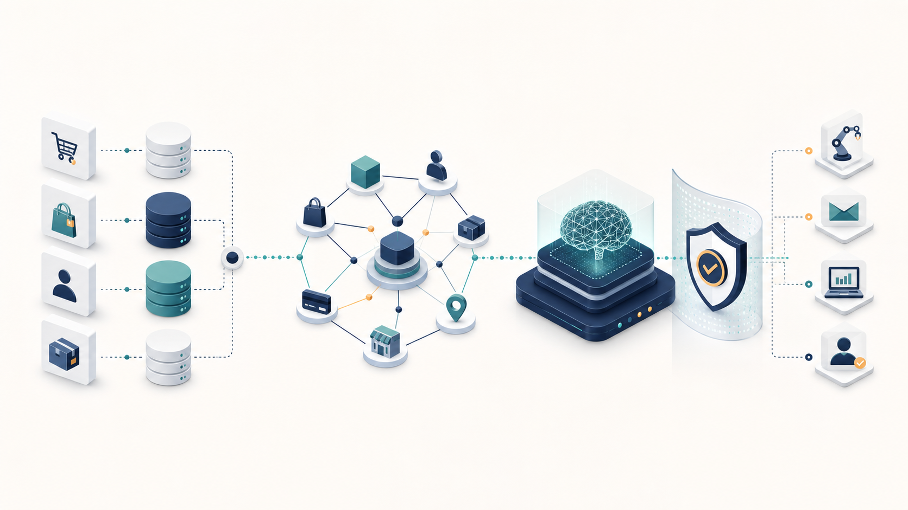

_图 1：从业务数据、Ontology、AI 决策到受治理动作的概念总览。精确模块拓扑见第 3 节。_

## 1. 执行摘要

Baxi 已经越过普通数据分析 Demo 阶段。它不再只是把 Olist CSV 转成报表，而是在尝试建立一个面向 Agent 的电商运营决策底座：

1. 将原始电商数据摄入 PostgreSQL，形成 `raw -> dwd -> mart -> ops` 数据链路。
2. 将订单、卖家、产品、区域、异常事件等业务概念建模为 Ontology 对象。
3. 在 LLM 前增加 classification、marking、redaction、lineage、action whitelist 和 context hash。
4. 将模型输出限制为结构化决策和动作建议，不允许模型直接修改业务数据。
5. 将高风险动作放入 proposal、review、apply、outbox、worker 和 adapter 链路。
6. 同时提供 HTTP API、MCP stdio Server、React 控制台和 Pi Agent 扩展。

当前可以把项目理解为一个“轻量级 AIP 风格原型平台”：核心骨架已经存在，但尚未成为生产可用的闭环。按当前源码与运行验证：

| 维度 | 估计完成度 | 判断 |
|---|---:|---|
| 功能模块覆盖 | 85% | 主要模块已存在，代码量和测试量足以支撑继续演进 |
| AIP 理念对齐 | 75% | 已有 Ontology、治理上下文、HITL、审计、Action 和 Agent 工具层 |
| 端到端连通性 | 60% | HTTP、MCP、Pi、数据库和外部适配器之间仍有多处契约漂移 |
| 生产发布准备度 | 60% | 存在安全、数据完整性、容器构建和 E2E 阻断项 |

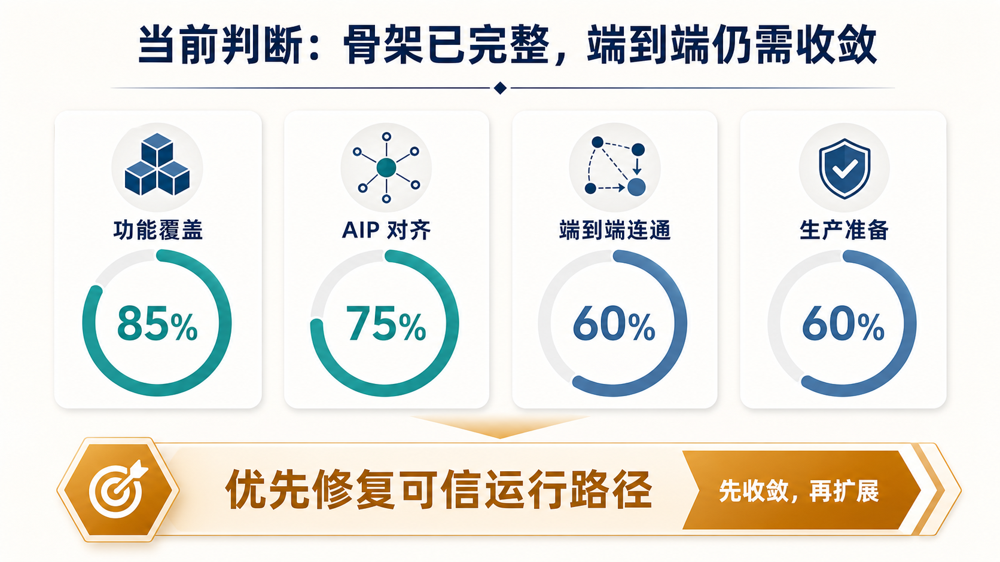

_图 2：当前完成度不是最终验收分数，而是用于排序下一阶段工程投入。结论是先收敛，再扩展。_

最重要的结论不是“项目还缺多少页面”，而是：**接下来应优先收敛唯一可信运行路径，而不是继续横向增加功能。**

## 2. Palantir AIP 理念及其对 Baxi 的启发

Palantir 官方将 AIP 描述为连接 AI、组织数据和实际运营过程的平台。其核心不是给数据库外面套一层聊天界面，而是让 AI 在 Ontology、治理、审计和受控动作边界内参与真实工作流。

Palantir 官方资料可以提炼出以下工程原则：

| AIP 原则 | 含义 | Baxi 中的对应设计 |
|---|---|---|
| 数据与运营连接 | AI 需要理解业务状态，并能进入实际运营流程 | Olist 数据管道、告警、任务、Outbox、飞书/GitHub adapter |
| Ontology 作为操作语言 | 用对象、属性、链接表达业务名词，用 Action 表达业务动词 | `customer`、`order`、`seller`、`metric_alert` 等对象；Action Registry |
| Grounded context | Agent 不应直接面对散乱 CSV，而应使用经过组织、脱敏、带证据的数据上下文 | DWD/Mart、Ontology 查询、`LLMSafeContext`、`LLMSafeContextEnvelope` |
| Security and governance | 人和 Agent 应服从统一的数据访问、用途说明和审计规则 | classification、marking、redaction、checkpoint、audit schema |
| Governed actions | AI 可以建议动作，但写操作必须结构化、可授权、可回溯 | proposal、human review、dry-run、apply、outbox、adapter |
| Explainability and evaluation | 决策需要证据、上下文版本、审计轨迹和可重复评估 | context hash、prompt version、LLM audit、replay、eval 表、sandbox |
| Human-in-the-loop | 自动化程度应随风险等级逐步提高 | 当前默认人工审核；低风险自动执行仅保留为受控能力 |
| Observability | 数据流、Agent 调用和动作执行应可追踪 | pipeline audit、API logs、agent execution、MCP call audit |

Palantir Ontology 的关键思想是同时表达：

- **语义层**：对象、属性、关系，即业务世界中的“名词”。
- **动力层**：动作、函数、自动化，即业务世界中的“动词”。
- **治理层**：权限、marking、用途说明、审计，即人和 Agent 都必须遵循的边界。

Baxi 已经采用了这一结构，但规模和实现方式更轻量：

| Palantir Foundry/AIP | Baxi 当前实现 |
|---|---|
| 企业级数据连接与分布式计算 | 本地 CSV + PostgreSQL + Go Pipeline |
| Ontology Object Types / Links / Actions | YAML schema + PostgreSQL 元数据表 + Go Registry + Action Registry |
| Markings / Checkpoints / Data Lineage | YAML 配置 + `gov.*` 表 + Go governance service |
| AIP Logic / Agent workflows | Go Decision Engine + Pi Skills + MCP tools |
| AIP Evals | replay、compare、eval 表、Pi skills 对比报告，尚未形成统一评估平台 |
| Apollo 级发布体系 | Docker Compose + GitHub Actions，仍需修复和加强 |

## 3. 项目整体定位

Baxi 的业务领域是电商运营治理。输入是 Olist 巴西电商公开数据集和营销漏斗数据，输出不是单一报表，而是可供运营人员和 Agent 消费的业务状态、异常、建议和动作。

可以将系统拆成六层：

### 3.1 架构图：GPT Image 2 信息图版

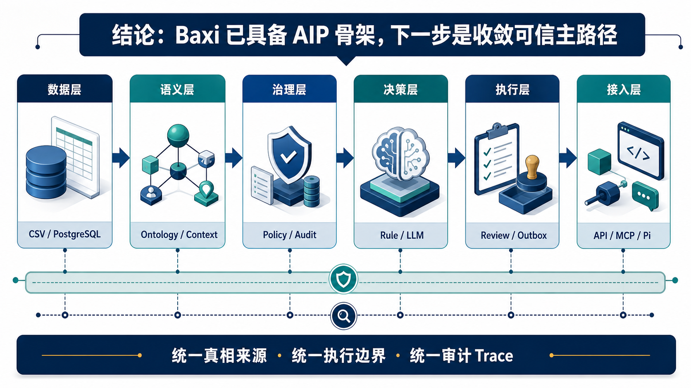

_图 3：结论先行的架构信息图。Baxi 已具备 AIP 骨架，下一步是统一真相来源、执行边界与审计 Trace。_

### 3.2 架构图：Mermaid 代码版

以下 Mermaid 图用于精确表达和持续维护。可复用源码位于 [`system-architecture.mmd`](assets/baxi-aip-report/system-architecture.mmd)。

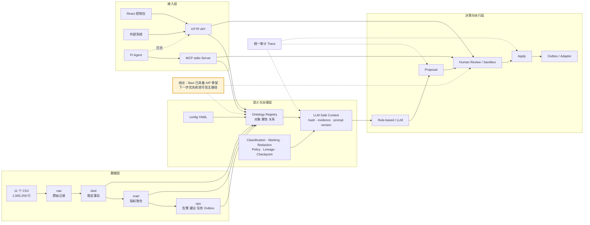

对应的主要源码入口：

| 能力 | 入口 |
|---|---|
| API 服务 | `cmd/baxi-api/main.go`、`internal/api/routes.go` |
| Worker | `cmd/baxi-worker/main.go`、`internal/worker/dispatch_worker.go` |
| Pipeline CLI | `cmd/baxi-cli/`、`internal/pipeline/` |
| MCP Server | `cmd/baxi-mcp/main.go`、`internal/mcp/` |
| Ontology | `internal/ontology/`、`config/aip_object_schema.yml` |
| Governance | `internal/governance/`、`config/*.yml` |
| Decision / LLM | `internal/decision/`、`internal/llm/` |
| Action / Review | `internal/action/`、`internal/review/` |
| Pi 扩展 | `pi-extension/`、`.pi/skills/` |
| React 控制台 | `frontend/src/` |

## 4. 数据集介绍

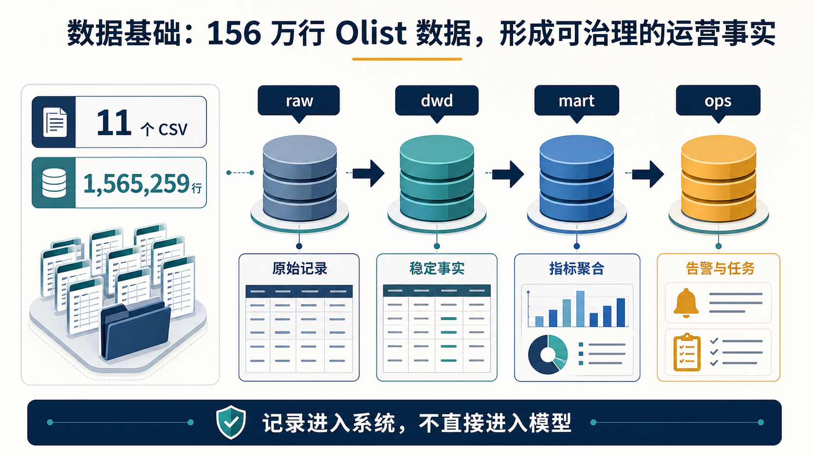

_图 4：11 个 CSV、1,565,259 行记录先进入数据分层，再转化为可治理的运营事实。_

### 4.1 原始数据来源

项目使用 Olist Brazilian E-Commerce Dataset 作为主要业务数据，并补充 Olist Marketing Funnel 数据。当前 `data/raw/` 中共有 11 个 CSV，合计 **1,565,259** 行数据记录。

| CSV | 行数 | 业务含义 | 主要连接键 |
|---|---:|---|---|
| `olist_customers_dataset.csv` | 99,441 | 客户与地理归属 | `customer_id`、`customer_unique_id` |
| `olist_orders_dataset.csv` | 99,441 | 订单主表与履约时间 | `order_id`、`customer_id` |
| `olist_order_items_dataset.csv` | 112,650 | 订单商品项、卖家、价格和运费 | `order_id`、`product_id`、`seller_id` |
| `olist_order_payments_dataset.csv` | 103,886 | 支付方式、分期和金额 | `order_id` |
| `olist_order_reviews_dataset.csv` | 104,719 | 评分和评论 | `order_id`、`review_id` |
| `olist_products_dataset.csv` | 32,951 | 产品品类、重量和尺寸 | `product_id` |
| `olist_sellers_dataset.csv` | 3,095 | 卖家地域信息 | `seller_id` |
| `olist_geolocation_dataset.csv` | 1,000,163 | 邮编前缀、经纬度和城市 | ZIP prefix |
| `product_category_name_translation.csv` | 71 | 葡萄牙语品类到英文品类 | `product_category_name` |
| `olist_marketing_qualified_leads_dataset.csv` | 8,000 | 营销线索与来源渠道 | `mql_id` |
| `olist_closed_deals_dataset.csv` | 842 | 已成交营销线索 | `mql_id`、`seller_id` |

核心关系如下：

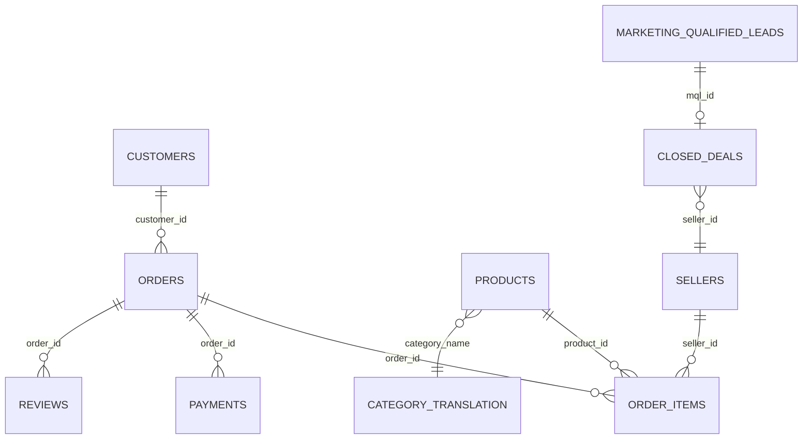

### 4.2 数据质量特征

原始数据不是干净的演示表，具有真实分析系统必须处理的质量问题：

| 问题 | 影响 |
|---|---|
| geolocation 有约 26% 重复行 | 地理聚合前必须去重或选取稳定口径 |
| 订单到商品、支付、评价是一对多关系 | 直接 join 会产生行数膨胀 |
| 产品品类存在约 2% 缺失 | 品类分析需要空值策略 |
| 履约日期存在缺失 | 配送时效指标需要显式排除未交付订单 |
| 评论文本可能包含敏感信息 | 不应直接送入 LLM 或外部渠道 |

现有离线数据字典可作为原始分析参考，但其中评论表行数和部分关系校验说明已落后于当前 CSV，应重新生成：

- `docs/data_dictionary.md`
- `docs/entity_relationships.md`
- `docs/analysis_base_tables.md`

### 4.3 早期 Agent 可读数据资产

`data/aip/` 保留了早期离线上下文包，用于让 Wake/Pi 类 Agent 在不直接读取原始 CSV 的前提下消费结构化业务信息。

| 文件 | 当前样本规模 | 用途 |
|---|---:|---|
| `aip_business_objects.json` | 3,195 个对象 | 卖家、品类、区域对象摘要 |
| `aip_metrics.json` | 161 条指标 | 日粒度指标序列 |
| `aip_events.json` | 10 个事件 | 运营异常事件 |
| `aip_action_recommendations.json` | 5 条建议 | 告警到动作建议 |
| `aip_context_bundle_latest.json` | 1 个快照 | 最近窗口、基线窗口、指标变化、允许动作 |
| `aip_context_bundle_full.json` | 1 个全量包 | 长周期摘要 |

这些 JSON 是重要的演进痕迹，但已经不是 Go/PostgreSQL 主运行链路的唯一真相来源。后续应将其定位为：

- 导出格式；
- Agent fixture；
- 回放样本；
- 决策评估数据集。

## 5. 数据如何转换为 Agent 可理解的语义层

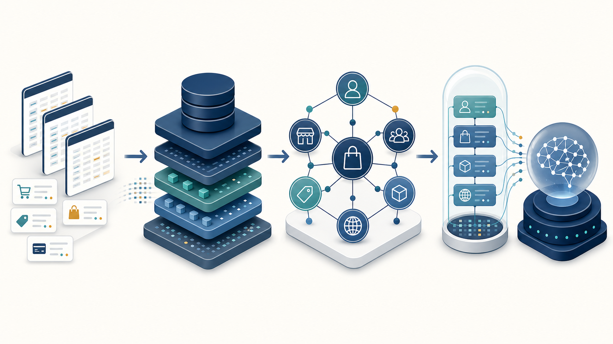

_图 5：原始业务记录经过数据分层、Ontology 和安全上下文，转化为 Agent 可消费的语义输入。_

### 5.1 PostgreSQL 分层模型

项目使用七个 PostgreSQL schema：

| Schema | 职责 | 当前本地基础表数量 |
|---|---|---:|
| `raw` | 原始 CSV 落库 | 12 |
| `dwd` | 稳定事实表和分析宽表 | 4 |
| `mart` | 聚合指标与维度指标 | 5 |
| `ops` | 告警、建议、任务、Outbox、外部任务 | 8 |
| `gov` | Ontology、marking、lineage、policy、配置快照 | 16 |
| `ai` | 决策 case、LLM 决策、proposal、review、sandbox、Agent 日志 | 12 |
| `audit` | Pipeline、API、MCP 和错误审计 | 7 |

这套分层让 LLM 不需要理解所有原始表。Agent 面向的是压缩后的业务事实和受治理对象，而不是任意 SQL 结果。

### 5.2 Pipeline：从 CSV 到运营事件

文档层面可以把管道理解为七个概念阶段；当前 HTTP API 实际装配为九个 Step：

| 顺序 | Step | 输入 | 输出 | 语义作用 |
|---:|---|---|---|---|
| 1 | `ingest_raw` | 11 个 CSV | `raw.*` | 建立原始数据事实 |
| 2 | `build_dwd_order_level` | orders、customers、payments、reviews | `dwd.order_level` | 一行一个订单 |
| 3 | `build_dwd_item_level` | items、products、sellers、translation | `dwd.item_level` | 一行一个订单商品项 |
| 4 | `build_metric_daily` | DWD 表 | `mart.metric_daily` | 全局日指标 |
| 5 | `build_metric_dimension_daily` | DWD 表 | `mart.metric_dimension_daily` | seller/category/region 维度指标 |
| 6 | `detect_alerts` | Mart 指标 | `ops.metric_alert` | 规则触发的异常事件 |
| 7 | `generate_recommendations` | 告警 | `ops.recommendation` | 模板型策略建议 |
| 8 | `generate_tasks` | 建议 | `ops.task` | 可分派工作项 |
| 9 | `create_outbox_events` | 任务 | `ops.outbox_event` | 外部渠道事件 |

Pipeline Runner 为每一步创建独立事务，并记录 `audit.pipeline_run` 和 `audit.pipeline_step_run`。这使每个阶段可回滚、可定位、可统计。

当前指标层包含：

- GMV；
- 订单数、客户数、卖家数；
- 客单价；
- 运费；
- 平均评分、低评分率；
- 延迟配送率；
- 取消率；
- 分期支付率；
- 营销卖家占比占位指标；
- seller/category/region 维度的 GMV、订单、客户、评分、履约和取消指标。

### 5.3 Ontology：把数据表变成业务对象

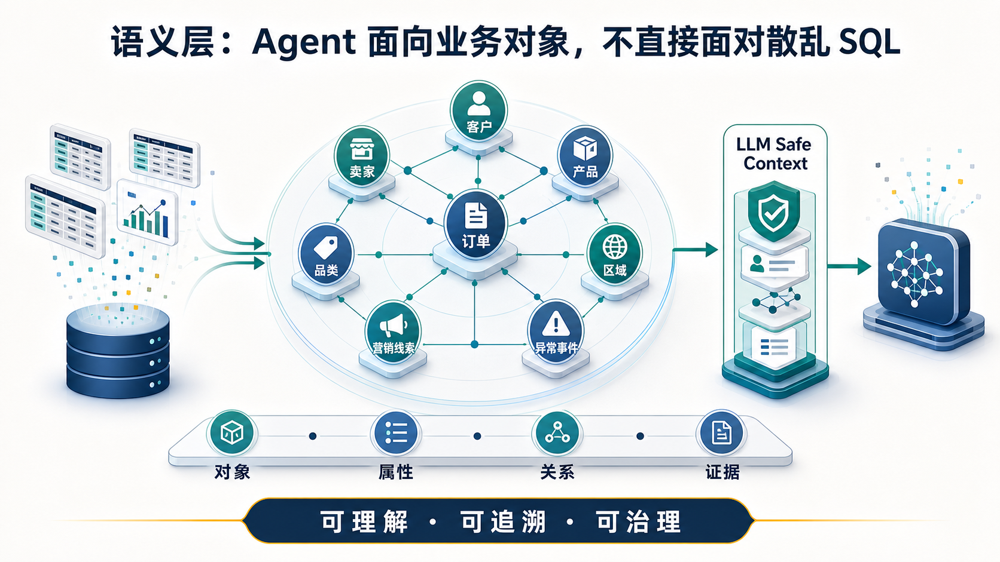

_图 6：Agent 面向客户、订单、卖家、产品、品类、区域、营销线索和异常事件，不直接面对散乱 SQL。_

Ontology 的目标不是复制 SQL schema，而是形成 Agent 可以理解的业务词汇表。

当前编译时明确支持 8 个核心对象：

| Object Type | 中文名 | Grain | 主要来源 | 典型用途 |
|---|---|---|---|---|
| `customer` | 客户 | `customer_unique_id` | `dwd.order_level` | 购买频次、消费金额、复购和区域分析 |
| `order` | 订单 | `order_id` | `dwd.order_level` | 履约、支付、评分和异常定位 |
| `seller` | 卖家 | `seller_id` | `dwd.item_level` | GMV、订单量、评分、延迟率 |
| `product` | 产品 | `product_id` | `dwd.item_level` | 品类、价格、运费、销量 |
| `category` | 品类 | `product_category_name` | `dwd.item_level` | 品类 GMV、订单和评分 |
| `region` | 区域 | `state` | DWD 两张事实表 | 区域客户、卖家、GMV、配送 |
| `marketing_lead` | 营销线索 | `origin` 或线索 ID | raw 营销漏斗 | 渠道转化分析 |
| `metric_alert` | 异常事件 | `alert_id` | `ops.metric_alert` | 决策触发器 |

当前显式关系较少：

| Source | Link | Target | Join Key |
|---|---|---|---|
| `seller` | `has_items` | `order` | `order_id` |
| `seller` | `has_products` | `product` | `product_id` |

`ContextBuilderV3` 支持最多两层关系遍历，将关联对象放入 `enriched_objects`，为 Agent 提供跨对象上下文。

### 5.4 Ontology 元数据的三套来源

当前项目存在三套尚未完全收敛的语义定义：

| 来源 | 对象数量 | 说明 |
|---|---:|---|
| `internal/ontology/object_type.go` | 8 | 编译时核心对象列表 |
| `migrations/020_seed_ontology_data.sql` | 8 | 数据库 normalized ontology seed |
| `config/aip_object_schema.yml` | 9 | 在 8 个核心对象外增加 `global` |
| `config/data_catalog.yml` | 9 | 在 8 个核心对象外增加 `channel`，但没有 `global` |

需要选定唯一规范来源，并由生成器同步其他视图。否则 API、MCP、治理页面和 Agent 会看到不同的业务世界。

### 5.5 当前运行时 Registry 行为

`ObjectRegistry` 的设计支持“数据库优先、YAML fallback”。但当前 API 和 MCP 装配都传入了空的 schema repository，因此实际上主要从 `config/aip_object_schema.yml` 加载。

数据库中的 `gov.object_type_registry`、`gov.object_property` 和 `gov.object_relationship` 已经存在，但尚未成为运行时唯一真相来源。

### 5.6 从 Ontology 到 LLM Safe Context

决策上下文不是简单 JSON dump。当前实现分为三个版本：

| 版本 | 能力 |
|---|---|
| V1 | case、告警、目标对象、基础 classification、redaction、允许与禁止动作 |
| V2 | OntologyAwareRepo、MarkingAdapter、Decision Lineage、PolicyResult、可审计 envelope |
| V3 | 在 V2 之上增加最大深度为 2 的对象链接遍历 |

LLM 最终接收的安全上下文包含：

```json
{
  "case_id": "case_xxx",
  "trigger": {
    "alert_id": "alert_xxx",
    "severity": "high",
    "metric_name": "late_delivery_rate",
    "current_value": 0.21,
    "baseline_value": 0.08,
    "delta_pct": 162.5
  },
  "object_context": {
    "object_type": "seller",
    "object_id": "seller_xxx",
    "properties": {}
  },
  "governance": {
    "classification": "L2",
    "redaction_applied": true,
    "redacted_fields": [],
    "role": "agent_readonly"
  },
  "allowed_actions": [],
  "forbidden_actions": [],
  "enriched_objects": []
}
```

外层 `LLMSafeContextEnvelope` 还记录：

- schema version；
- context hash；
- evidence；
- redaction summary；
- prompt version；
- config versions；
- built timestamp。

这使后续 replay、审计和模型对比成为可能。

## 6. Governance：语义层不只是可读，还必须可控

### 6.1 Classification

`config/data_classification.yml` 对 raw、DWD、mart、ops、API 和日志资产进行分级。Go 代码将配置映射到：

| 原始分类 | Canonical Level |
|---|---|
| `public_internal` | `L1` |
| `internal`、`derived_sensitive` | `L2` |
| `pii`、`sensitive` | `L3` |

### 6.2 Markings

`config/data_markings.yml` 定义四种 mandatory marking：

| Marking | 作用 |
|---|---|
| `PII` | 客户标识等个人信息 |
| `OPERATIONAL_INTERNAL` | 告警、建议、任务、复盘、Outbox |
| `FINANCIAL_INTERNAL` | 支付金额、商品价格、运费 |
| `RAW_DATA` | 未处理原始表 |

设计上 marking 优先于普通 classification，并沿数据依赖传播。这与 Palantir Markings 的思想一致：权限限制应该跟随数据，而不是只依赖数据所在目录。

### 6.3 Redaction

`internal/governance/redaction.go` 在上下文进入 Agent 前执行字段级脱敏：

- `PII`、`FINANCIAL_INTERNAL`、`RAW_DATA` 对非管理员隐藏；
- `sensitive`、`derived_sensitive` 对 `agent_readonly` 隐藏；
- 输出同时记录被隐藏字段和规则原因；
- 字段按名称排序，保证结果可重复。

### 6.4 Lineage

项目有两种 lineage：

| 类型 | 用途 |
|---|---|
| 数据 lineage | 描述 CSV、DWD、Mart、告警、建议、任务、Outbox、飞书同步之间的数据流 |
| 决策 lineage | 描述 context 构建、模型请求、模型输出、repair、fallback、proposal、review、apply 等决策事件 |

当前数据库 seed 中有 26 个 lineage node 和 17 条 edge。

### 6.5 Access Policy 与 Checkpoint

项目已经定义：

- `config/access_policy.yml`：角色、允许动作和可访问数据；
- `config/checkpoint_rules.yml`：外部同步、Outbox 分发、导出、删除等敏感操作的用途说明；
- `internal/governance/access_policy.go`；
- `internal/governance/checkpoint.go`；
- `internal/api/middleware/rbac.go`。

但当前 HTTP 路由只启用了 bearer token，未启用 RBAC middleware；checkpoint 服务主要用于查询和判断，也没有成为写操作的强制门禁。因此这部分应标记为 **部分实现**，不能视为生产级治理闭环。

## 7. 决策引擎与 LLM 接入

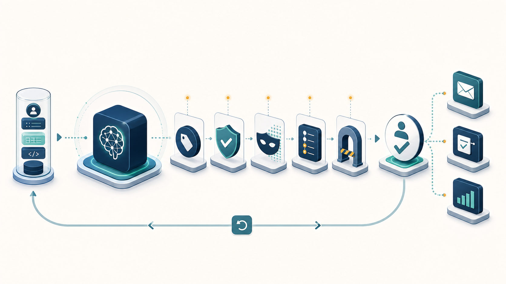

_图 7：模型决策经过分类、脱敏、策略、审计、checkpoint 和人工审核后，才进入受控动作通道。_

### 7.1 决策闭环

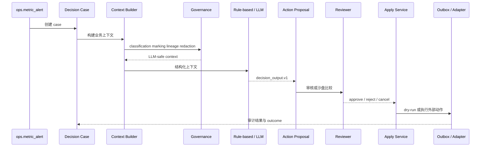

### 7.2 Provider 模型

当前有两类 provider：

| Provider | 状态 | 说明 |
|---|---|---|
| `RuleBasedProvider` | 默认启用 | 按 severity 产生确定性建议，作为主路径或 fallback |
| `OpenAICompatibleProvider` | 代码就绪，默认关闭 | 支持 OpenAI-compatible API、prompt 模板、超时、固定 seed、结构化 JSON |

环境变量默认值为：

```text
LLM_ENABLED=false
LLM_PROVIDER=disabled
LLM_MODEL=gpt-4o-mini
```

因此当前系统默认不是“LLM 自动决策”，而是“规则决策 + 可激活 LLM provider”。

### 7.3 结构化输出与校验

模型输出必须符合 `DecisionOutput`：

- `decision_type`；
- `severity`；
- `summary`；
- `rationale`；
- `recommended_actions`；
- `confidence`；
- `requires_human_review`。

校验器会检查：

- decision type 和 severity 枚举；
- confidence 必须在 `[0, 1]`；
- `requires_human_review` 必须为 `true`；
- 推荐动作必须属于上下文中的 allowlist；
- 非法输出先尝试 repair，再 fallback 到规则引擎。

### 7.4 Action Registry

当前白名单只允许四类动作：

| Action | Adapter | 默认审核 | 默认 dry-run |
|---|---|---|---|
| `create_followup_task` | GitHub | 是 | 是 |
| `notify_owner` | Feishu | 是 | 是 |
| `export_report` | Feishu | 是 | 是 |
| `create_outbox_message` | Feishu | 是 | 是 |

每个动作还包含：

- payload JSON schema；
- risk level；
- allowed roles；
- LLM 可见性；
- 面向 LLM 的动作说明；
- schema version。

### 7.5 Human Review、Sandbox 和执行

高风险写操作遵循：

```text
Decision -> Proposal -> Approve/Reject/Cancel -> Dry-run -> Apply -> Adapter -> Outcome/Audit
```

项目同时提供 proposal sandbox，用于将多个提案加入不同 sandbox 后进行比较。这对应 AIP 风格的“先分析和模拟，再进入实际操作”。

## 8. HTTP API 设计

Go chi API 位于 `/api/v1`，当前有 **52** 个路由注册。

| Domain | 核心接口 | 用途 |
|---|---|---|
| Health | `GET /health` | 基础健康检查 |
| Qoder context | `GET /qoder/capabilities`、`GET /qoder/context` | 外部 Agent 读取能力矩阵和聚合上下文 |
| Status | `GET /status` | 数据库、pipeline 和系统状态 |
| Alerts / Tasks | `GET /alerts`、`GET /tasks` | 运营工作台 |
| Outbox | `GET /outbox`、`POST /outbox/dispatch` | 分发队列 |
| Governance | `/governance/*` | catalog、classification、marking、lineage、checkpoint、health |
| Logs | `/logs/*` | 请求、错误、审计、诊断、Agent 执行日志 |
| Feishu | `/feishu/*` | 导出、同步、状态导入 |
| LLM | `/llm/status`、`/llm/metrics` | Provider 状态与指标 |
| Decisions | `/decisions/cases/*` | case、context、decide、LLM、compare、replay、eval |
| Review / Action | `/proposals/*` | 审核、状态和执行 |
| Pipeline | `POST /pipeline/run` | 异步启动流水线 |
| Sandbox | `/sandboxes/*` | 创建、读取、比较、加入 proposal |

API 已具备的设计优点：

- DTO 与 domain model 分离；
- 统一错误格式；
- `X-Request-ID`；
- CORS；
- timeout；
- bearer token；
- handler、service、repository 分层；
- 列表接口分页；
- Agent execution logs。

当前应优先修复：

1. `/qoder/context` 位于认证组之外，会返回运营上下文。
2. `/status` 会暴露完整 `DATABASE_URL`，包括密码。
3. 路由层尚未启用 RBAC。
4. Pipeline 只提供执行接口，没有独立 preview 接口。

## 9. MCP Server 设计

### 9.1 为什么需要 MCP

HTTP API 面向应用开发；MCP 面向 Agent 工具发现和调用。MCP 官方定义 host、client、server 三类角色，server 可以暴露 tools、resources 和 prompts。Baxi 当前选择 stdio transport，适合本地 Pi Agent 或其他桌面 Agent 启动一个受控的本地业务工具进程。

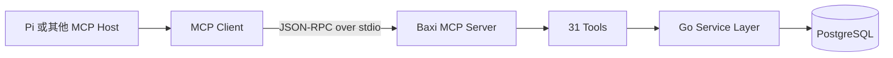

### 9.2 当前 MCP 工具

`internal/mcp/` 当前注册 **31** 个 tools，覆盖 11 个业务域：

| Domain | Tools |
|---|---|
| Status | `get_system_status`、`search_objects` |
| Ontology | `describe_ontology`、`get_object`、`get_linked_objects`、`execute_action` |
| Action Schema | `list_action_schemas`、`get_action_schema` |
| Governance | `check_access`、`get_classification` |
| Sandbox | `create_sandbox`、`add_to_sandbox`、`compare_sandboxes`、`get_sandbox` |
| Decision | `create_decision_case`、`decide`、`resolve_case`、`list_cases`、`get_case`、`list_proposals` |
| Alerts | `list_alerts` |
| Pipeline | `run_pipeline` |
| Action | `execute_proposal`、`get_decision_context` |
| Outbox | `list_outbox_events`、`get_pipeline_status` |
| Review | `approve_proposal`、`reject_proposal`、`cancel_proposal`、`get_proposal_by_id`、`list_review_records` |

### 9.3 当前 MCP 的边界

MCP Server 已实现 stdio transport 和工具 schema，但尚不是完整生产主路径：

| 问题 | 当前状态 |
|---|---|
| Pipeline | MCP 入口只装配 `ingest_raw` 和 `build_dwd_order_level` 两步，HTTP API 装配九步 |
| Provider | MCP 决策引擎固定使用 rule-based，未读取 HTTP API 使用的 LLM provider factory |
| Execute | MCP ApplyService 未装配 Feishu/GitHub executors，真实执行会失败 |
| Protocol coverage | 当前只暴露 tools，没有进一步提供 MCP resources 和 prompts |
| Audit | 数据库已有 `audit.mcp_call`，但应继续核对所有调用是否统一落表 |

推荐将 MCP 定位为 Agent 的主工具边界，并使它复用与 HTTP API 相同的 application composition root，避免两套装配长期漂移。

## 10. Pi Agent 接入


_图 8：推荐的 Agent 接入形态。MCP 作为主要工具边界，HTTP API 保留为补充控制通道。_

### 10.1 当前有两种 Pi 接入方式

项目中同时存在：

1. **Pi TypeScript 扩展**：`pi-extension/`，当前主要直接调用 HTTP API。
2. **Pi Skills**：`.pi/skills/`，描述订单治理、卖家治理和争议处理的 V1/V2/V3 推理框架。

当前 TypeScript 扩展包括：

| 扩展 | 作用 | 注册工具数 |
|---|---|---:|
| `baxi-decision` | case、decision、review、governance、status | 13 |
| `baxi-operations` | context、execute、outbox、pipeline、search、review | 12 |
| `baxi-sandbox` | sandbox 和 ontology 辅助工具 | 7 |
| `baxi-logger` | 将 Pi 工具执行结果写入 `/logs/agent` | 事件监听器 |

### 10.2 Pi Skills 的分层设计

`.pi/skills/` 当前有三组领域技能，每组包含 V1、V2、V3：

| Skill Family | V1 | V2 | V3 |
|---|---|---|---|
| `order-governance` | 固定阈值风控 | 客户历史与动态阈值 | Ontology 跨域分析与反馈回路 |
| `seller-governance` | 固定健康度评分 | 趋势、类目 benchmark | 商品、争议、卖家网络联动 |
| `dispute-resolution` | 争议分类路由 | 客户历史和赔付策略 | 客户、卖家、产品跨域责任分析 |

这种版本化设计有价值，因为它允许比较：

- 规则是否过严或过松；
- 引入上下文后是否改善结果；
- Ontology 跨域信息是否产生实际增益；
- 复杂度提升是否值得。

`.pi/tests/comparison-report.md` 已保留订单治理技能对比结果，可继续演进为统一 Eval Suite。

### 10.3 当前 Pi 接入的契约漂移

Pi 扩展虽然有单元测试，但与当前 HTTP 路由并非完全一致：

| Pi 扩展请求 | 当前 API 路由 | 状态 |
|---|---|---|
| `/governance/access` | 未注册 HTTP 路由 | 不可用，应走 MCP `check_access` 或补 API |
| `/pipeline/status` | 未注册 HTTP 路由 | 不可用 |
| `/search` | 未注册 HTTP 路由 | 不可用，应走 MCP `search_objects` 或补 API |
| `/ontology/object/...` | 未注册 HTTP 路由 | 不可用，应走 MCP ontology tools 或补 API |
| 创建 case 时发送 `case_id/object_type/object_id` | API 要求 `source_type/source_id` | 不兼容 |

因此“Pi 已接入”应准确表述为：

- 扩展框架、工具定义、日志回传和 Skills 已经存在；
- 一部分 HTTP 工具可工作；
- Ontology 和治理增强能力更适合切到 MCP；
- 完整 E2E 接入仍需契约收敛。

### 10.4 推荐的 Pi 接入方式

```text
Pi Agent
  -> MCP client
    -> Baxi MCP stdio server
      -> shared application services
        -> Ontology / Governance / Decision / Action / Audit

Pi logger extension
  -> authenticated HTTP API /logs/agent
```

保留 HTTP API 作为控制台和外部系统接口；让 Pi 的业务工具尽量通过 MCP 发现和调用。这样工具 schema、权限边界和 Agent 可用能力更清晰。

## 11. React 控制台、Worker 和外部系统

### 11.1 React 控制台

React 19 SPA 当前有 14 个页面：

- 总览；
- 告警；
- 任务；
- Outbox；
- 日志；
- 飞书；
- Pipeline；
- Governance；
- Agent Logs；
- Case Detail；
- Audit Timeline；
- Policy Inspector；
- Decision Review；
- Sandbox Compare。

它已经从简单报表页扩展为治理和决策运营台。

当前 Pipeline 页存在高风险交互问题：按钮写着“查看预览”，但点击后直接调用 `POST /pipeline/run` 启动完整异步流水线。应拆成：

```text
POST /pipeline/preview
POST /pipeline/run  + 显式确认 + 并发锁 + 幂等键
```

### 11.2 Worker 和 Outbox

Worker 负责轮询 `ops.outbox_event` 并通过 ActionExecutor 分发。目标设计是将外部副作用从同步 API 请求中隔离，获得：

- 重试；
- 最大尝试次数；
- `next_retry_at`；
- dry-run；
- 分发归档；
- 外部引用；
- 审计日志。

当前仍需统一 outbox payload：Pipeline 创建的 task outbox payload 与 DispatchWorker 期望的 `ActionProposal` payload 并不完全相同；channel 命名也存在 `feishu_cli/local_cli` 与 worker executor map 中 `feishu/github` 的不一致。

### 11.3 飞书和 GitHub

项目有两套飞书相关实现：

| 能力 | 代码位置 | 说明 |
|---|---|---|
| Action 通知 | `internal/adapter/feishu.go` | proposal 转飞书群消息 |
| Bitable 同步 | `internal/feishu/client.go` | 飞书多维表格查询、upsert、消息发送 |

真实飞书消息发送需要：

- `FEISHU_APP_ID`；
- `FEISHU_APP_SECRET`；
- `FEISHU_CHAT_ID`；
- 可选 Bitable app token。

但当前 `internal/config.Config` 只加载 `FEISHU_WEBHOOK_URL`，API/Worker 构造 adapter 时也只传 webhook。因此 dry-run 可用，真实飞书链路尚未接通。

GitHub adapter 已具备 Issue 创建和评论能力，但配置层只加载 token，没有提供 repository 字段，真实创建 Issue 同样需要补齐配置装配。

## 12. 当前本地运行状态与验证结果

### 12.1 本地数据库快照

当前 PostgreSQL 容器健康，全部 29 个 migration 文件对应版本已记录为 applied。数据库中：

| 指标 | 当前值 |
|---|---:|
| raw orders | 99,441 |
| dwd orders | 99,443 |
| dwd items | 112,652 |
| alerts | 1 |
| recommendations | 0 |
| tasks | 0 |
| outbox | 0 |
| decision cases | 2 |
| proposals | 1 |
| ontology object types | 8 |
| ontology properties | 56 |
| ontology relationships | 2 |
| marking definitions | 4 |
| marking assignments | 21 |
| lineage nodes | 26 |
| lineage edges | 17 |
| classifications | 0 |
| access policies | 0 |

需要注意：

1. `mart.metric_daily` 当前缺失，但 migration 状态显示已应用。
2. DWD 行数比 raw 多 2 行，说明本地开发库存在污染或测试隔离问题。
3. classifications 和 access policies 尚未 load 到数据库。
4. 最近多次 pipeline run 因 `mart.metric_daily` 缺失或并发 deadlock 失败。

### 12.2 已通过验证

| 检查 | 结果 |
|---|---|
| `go test ./... -count=1` | 通过 |
| `go vet ./...` | 通过 |
| `go build ./cmd/...` | 通过 |
| migration contract tests | 通过 |
| Go 内部包覆盖率 | 71.6% |
| React 单元测试 | 195/195 通过 |
| Pi extension Vitest | 75/75 通过 |

### 12.3 未通过验证

| 检查 | 结果 | 主要原因 |
|---|---|---|
| `docker compose build api worker` | 失败 | Docker Go 1.23，但 `go.mod` 要求 Go 1.24 |
| Frontend build | 失败 | 测试组件 TypeScript 类型错误 |
| Frontend lint | 失败 | 2 个 lint error，另有 warning |
| Frontend format check | 失败 | 52 个文件未通过 Prettier |
| Go tagged E2E | 编译失败 | 旧构造器 API 和测试 server API 已过期 |
| Playwright | 10/201 通过 | 大量接口 mock、运行依赖和 UI 断言过期 |

## 13. 风险与缺口清单

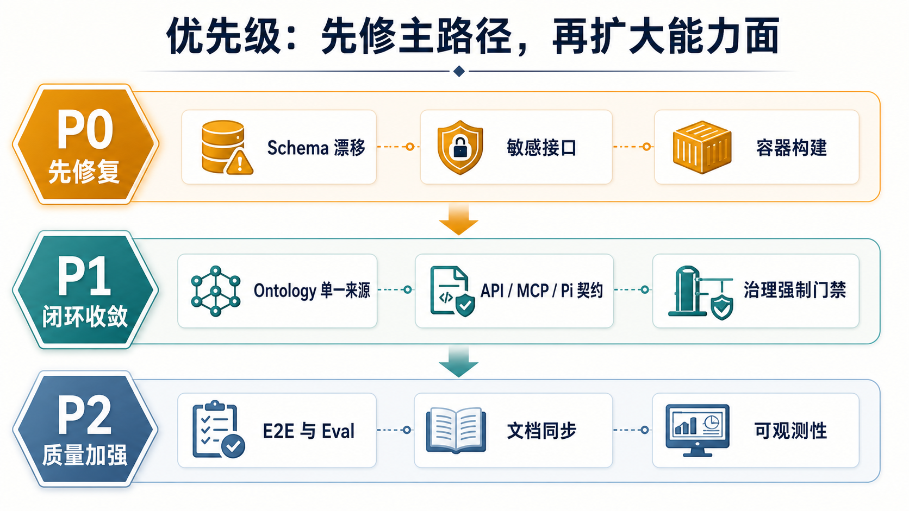

_图 9：优先修复可信主路径，再继续扩大能力面。P0 是恢复可信运行的阻断项。_

### 13.1 P0：先修复再继续扩展

| 问题 | 影响 | 建议 |
|---|---|---|
| Pipeline “预览”按钮触发真实执行 | 误操作、并发 deadlock、数据污染 | 增加 preview API、确认框、锁和幂等键 |
| `mart.metric_daily` 已迁移但本地缺表 | Pipeline 主链路失败 | 修复开发库，隔离测试数据库，扩充 schema contract |
| `/qoder/context` 无鉴权 | 泄露运营上下文 | 移入 auth group |
| `/status` 暴露完整数据库 URL | 泄露密码 | 只返回脱敏 host/db/schema 信息 |
| Docker / CI Go 版本落后 | 无法可靠构建发布 | 统一到 Go 1.24 或更高一致版本 |

### 13.2 P1：闭环收敛

| 问题 | 影响 | 建议 |
|---|---|---|
| Ontology 有 8/9 对象源定义漂移 | Agent、API 和治理页看到不同对象 | 选定单一 schema source 并自动生成其他视图 |
| API、MCP composition root 不一致 | 同一动作经不同入口得到不同能力 | 抽取共享 application wiring |
| MCP Pipeline 只有两步 | Agent 触发结果与 API 不一致 | 复用完整 Pipeline factory |
| MCP 固定 rule-based | Agent 无法使用已配置 LLM | 复用 ProviderFactory |
| Pi 扩展引用不存在的 HTTP 路由 | 部分 Pi 工具不可用 | 优先改为 MCP；必要接口补 HTTP |
| Governance 配置未 load，RBAC/checkpoint 未强制执行 | “有规则”但没有真实门禁 | 加启动校验和写路径 enforcement |
| Worker payload/channel 契约不一致 | Outbox 无法稳定分发 | 统一 event schema 和 channel registry |
| 飞书/GitHub 配置未完整装配 | 外部动作仅 dry-run 可用 | 补齐环境变量和真实集成测试 |

### 13.3 P2：质量和维护

| 问题 | 建议 |
|---|---|
| README、AGENTS、部分治理文档仍有旧统计或 SQLite 表述 | 在主路径稳定后统一刷新 |
| `data/aip/` 离线包与数据库主路径关系不清 | 标记为 export/fixture/replay，不再视为 canonical |
| CI 未覆盖 Docker、frontend build/lint/format、Playwright、Pi、tagged E2E | 增加 release gate |
| Makefile 中前端和 Pi 测试使用 `|| true` | 移除吞错逻辑 |
| Worker 同时启动 placeholder worker 和 dispatch worker | 删除无业务价值的 placeholder |
| API shutdown 将 `http.ErrServerClosed` 当 fatal | 正常处理优雅退出 |
| 生成产物和已提交二进制造成仓库噪音 | 完善 `.gitignore` 并清理 tracked artifact |

## 14. 推荐目标架构

短期目标不是继续增加更多 Agent，而是把所有入口收敛到同一组业务服务：

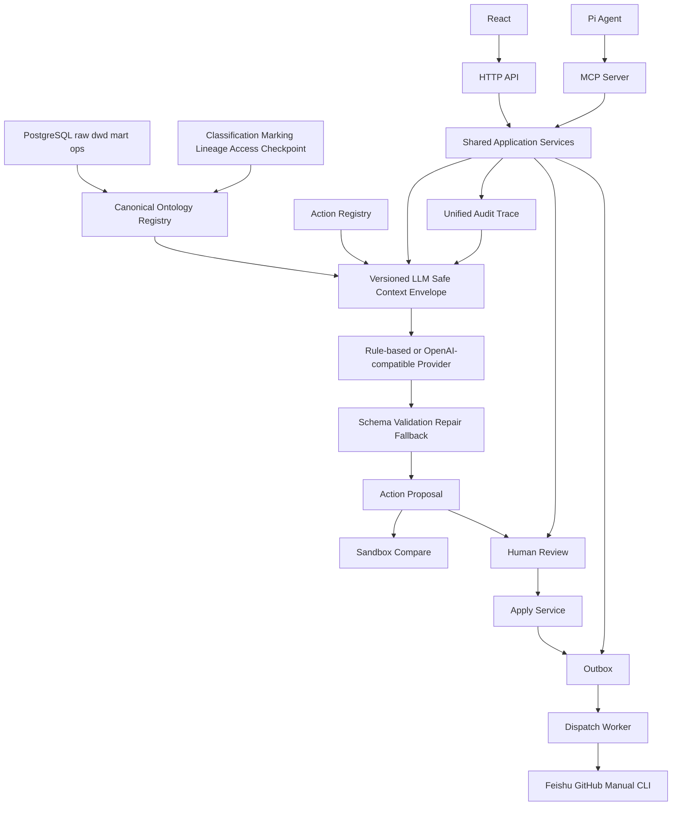

### 14.1 单一真相来源

推荐：

1. 以 normalized `gov.object_type_registry`、`gov.object_property`、`gov.object_relationship` 为运行时 canonical source。
2. 使用生成器从 canonical source 输出 YAML、catalog、OpenAPI 和 Agent tool descriptions。
3. 启动时校验 schema、classifications、access policies、markings 和 lineage 是否完整。
4. 任何缺失都应导致 degraded 状态；关键缺失应拒绝执行写操作。

### 14.2 单一执行边界

推荐：

1. HTTP API 与 MCP 共用同一组 factory。
2. Pi 业务工具优先走 MCP。
3. React 和外部系统走 HTTP API。
4. 所有真实写操作都经过 proposal、review/checkpoint、apply、outbox。
5. Agent 永远不直接修改 raw、DWD 或 mart 表。

### 14.3 可评估的 Agent 生命周期

推荐将现有 Pi Skills、sandbox、compare、replay、decision eval 统一为 Eval Suite：

| 资产 | 用途 |
|---|---|
| 固定输入 case | 回归测试 |
| 期望 decision schema | 正确性判断 |
| 规则 provider 输出 | 稳定 baseline |
| LLM provider 输出 | 模型效果比较 |
| Pi Skill V1/V2/V3 | prompt 和上下文复杂度比较 |
| sandbox | 执行动作前影响分析 |
| outcome | 真实执行反馈 |

## 15. 分阶段路线图

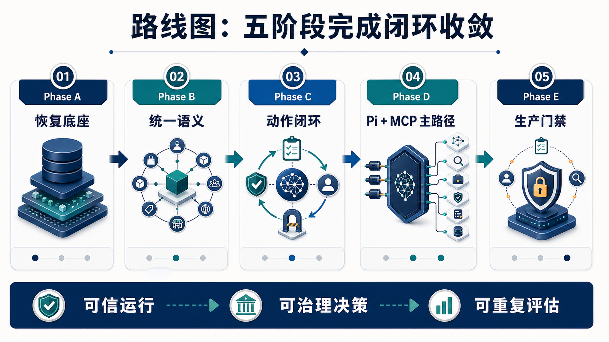

_图 10：从恢复底座到生产门禁，路线图围绕可信运行、可治理决策和可重复评估展开。_

### Phase A：恢复可信运行底座

- 修复本地 `mart.metric_daily`；
- 隔离测试数据库；
- 增加 mart、gov、ai 全量 schema contract；
- 将 pipeline preview 与 run 分离；
- 修复 API 信息泄露；
- 统一 Go 版本和 Compose token。

### Phase B：收敛语义层

- 确定 canonical ontology source；
- 消除 `global` / `channel` 漂移；
- 完整加载 classification 和 access policy；
- 扩充 object links；
- 让 HTTP 和 MCP 共用 V3 context builder；
- 将 marking 和 redaction 作为 Agent 上下文强制前置步骤。

### Phase C：收敛动作闭环

- 将 checkpoint 接入真实写操作；
- 统一 action proposal、outbox event 和 worker payload；
- 统一 channel naming；
- 完整装配 Feishu 和 GitHub；
- 将 outcome 回写 decision context；
- 为每次 apply 形成统一 trace。

### Phase D：Pi 与 MCP 主路径

- 将 Pi 扩展中 ontology、search、governance、pipeline 工具迁到 MCP；
- 保留 logger 的 HTTP 回传；
- 修复 Pi Skills 中参数名称与 MCP JSON schema 的差异；
- 增加 Pi -> MCP -> PostgreSQL -> audit E2E；
- 评估是否增加 MCP resources 和 prompts。

### Phase E：生产门禁

- 修复 frontend build、lint、format；
- 修复 tagged Go E2E；
- 修复 Playwright；
- 将 Docker build、Pi test、E2E、schema contract 加入 CI；
- 增加敏感接口安全测试；
- 引入 migration smoke test 和 dry-run deployment。

## 16. 代码阅读索引

| 主题 | 推荐入口 |
|---|---|
| 总览 | `README.md`、`AGENTS.md` |
| 原始数据 | `data/raw/`、`docs/data_dictionary.md` |
| Pipeline | `internal/pipeline/runner.go`、`internal/pipeline/steps/` |
| 数据库结构 | `migrations/001_init_schemas.sql` 到 `migrations/031_relax_hitl_check.sql` |
| Ontology schema | `config/aip_object_schema.yml`、`internal/ontology/` |
| Governance | `config/data_classification.yml`、`config/data_markings.yml`、`config/data_lineage.yml`、`internal/governance/` |
| Context builder | `internal/decision/context_builder.go`、`context_builder_v2.go`、`context_builder_v3.go` |
| LLM | `internal/llm/provider.go`、`openai_provider.go`、`rule_provider.go` |
| Action | `config/action_registry.yml`、`internal/action/` |
| HTTP API | `internal/api/routes.go`、`internal/api/handler/` |
| MCP | `cmd/baxi-mcp/main.go`、`internal/mcp/` |
| Pi | `pi-extension/`、`.pi/skills/`、`.pi/tests/` |
| React 控制台 | `frontend/src/App.tsx`、`frontend/src/pages/` |
| Worker | `cmd/baxi-worker/main.go`、`internal/worker/dispatch_worker.go` |

## 17. 外部参考资料

Palantir 官方：

- [AIP overview](https://www.palantir.com/docs/foundry/aip/overview/)
- [Platform overview](https://www.palantir.com/docs/foundry/platform-overview/overview/index.html)
- [AIP architecture](https://www.palantir.com/docs/foundry/architecture-center/aip-architecture)
- [The Ontology system](https://www.palantir.com/docs/foundry/architecture-center/ontology-system)
- [Ontology architecture](https://www.palantir.com/docs/foundry/object-backend/overview)
- [AIP Logic](https://www.palantir.com/docs/foundry/logic/overview/)
- [AIP observability](https://www.palantir.com/docs/foundry/aip-observability/overview/)
- [AIP Evals](https://www.palantir.com/docs/foundry/aip-evals/overview/)
- [Markings](https://www.palantir.com/docs/foundry/security/markings/index.html)
- [Checkpoints](https://www.palantir.com/docs/foundry/checkpoints/overview)
- [Data Lineage](https://www.palantir.com/docs/foundry/data-lineage/overview/)
- [Data Lifetime](https://www.palantir.com/docs/foundry/data-lifetime/overview/)

MCP 官方：

- [MCP Architecture overview](https://modelcontextprotocol.io/docs/learn/architecture)
- [Understanding MCP servers](https://modelcontextprotocol.io/docs/learn/server-concepts)
- [MCP SDKs](https://modelcontextprotocol.io/docs/sdk)

数据集：

- [Olist Brazilian E-Commerce Dataset](https://www.kaggle.com/datasets/olistbr/brazilian-ecommerce)

## 18. 最终判断

Baxi 已经具备一个 AIP 风格电商治理决策平台所需要的大部分“名词”和“动词”：

- 有数据底座；
- 有 Ontology；
- 有治理配置；
- 有 LLM-safe context；
- 有规则和可激活 LLM provider；
- 有 proposal、review、sandbox、outbox；
- 有 API、MCP、Pi 和 React；
- 有审计表和测试。

当前最大问题不是缺少功能，而是多条演进路径尚未收敛：

- YAML、seed 和 catalog 的 Ontology 不完全一致；
- HTTP、MCP 和 Pi 的接口装配不完全一致；
- 治理规则存在，但部分没有成为强制门禁；
- 外部 adapter 有代码，但配置没有完整接通；
- 本地数据库 schema 已经漂移；
- 发布链路还没有成为可靠门禁。

下一阶段应以“唯一真相来源、唯一执行边界、统一审计 trace、可重复 E2E”为目标。完成这轮收敛后，项目才适合进入真实 LLM 激活、真实飞书接入和更高等级自动化。

## 附录：备选视觉资产

正文使用 10 张图片。另有 5 张 GPT Image 2 备选图，没有直接插入正文，可用于后续替换或演示文稿：

| 备选图 | 适用场景 |
|---|---|
| [`governance-rail-layered-architecture.png`](assets/baxi-aip-report/alternatives/governance-rail-layered-architecture.png) | 强调 Governance Rail 贯穿全部架构层 |
| [`llm-safe-context-envelope.png`](assets/baxi-aip-report/alternatives/llm-safe-context-envelope.png) | 解释模型只接收被允许的事实 |
| [`pi-mcp-primary-path.png`](assets/baxi-aip-report/alternatives/pi-mcp-primary-path.png) | 强调 Pi 通过 MCP 获取统一工具边界 |
| [`governed-action-review-flow-v2.png`](assets/baxi-aip-report/alternatives/governed-action-review-flow-v2.png) | 展示写操作审核、执行与审计链路 |
| [`eval-lifecycle.png`](assets/baxi-aip-report/alternatives/eval-lifecycle.png) | 展示 replay、compare、eval 与 outcome 生命周期 |

完整图片清单位于 [`docs/assets/baxi-aip-report/README.md`](assets/baxi-aip-report/README.md)。
