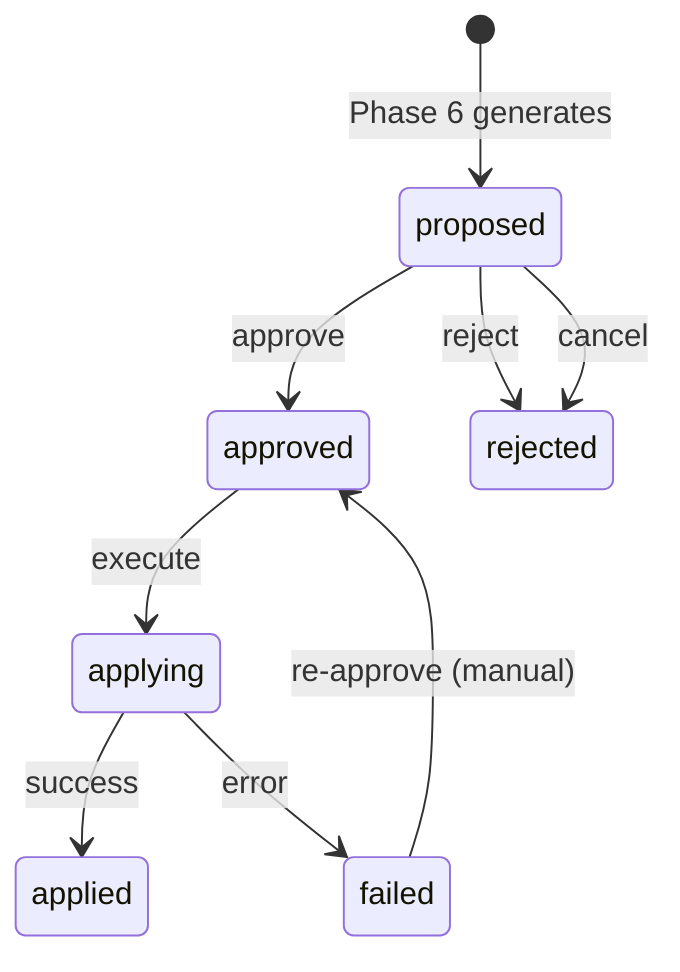
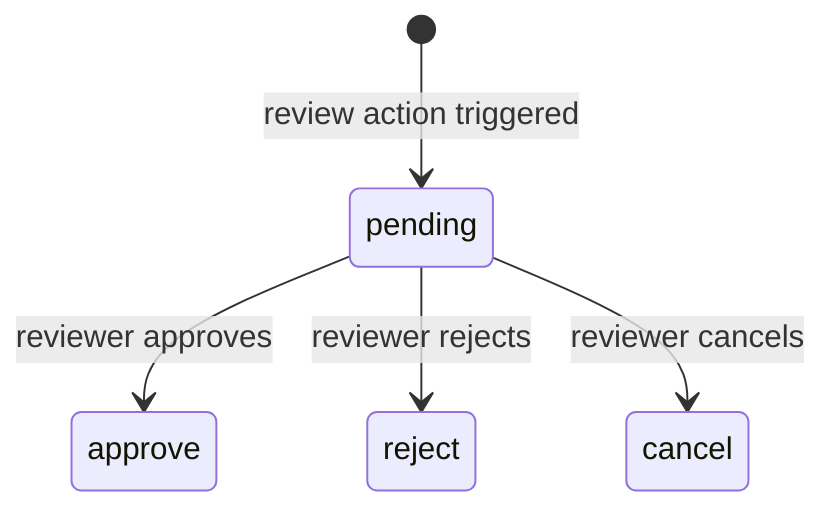
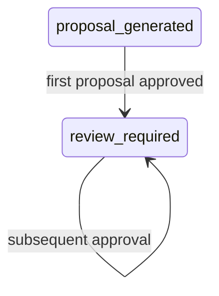
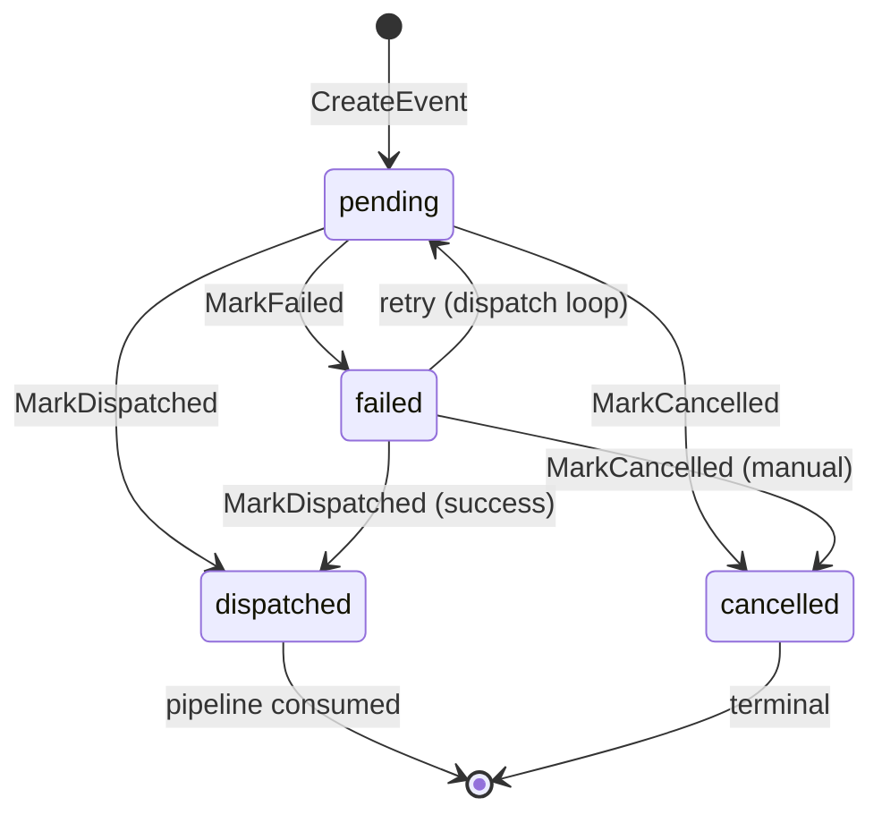

# Phase 7: Review / Action / Outbox State Machine

## 1. 概述

Phase 7 构建完整的人工审核 → 批准 → 执行 → outbox 分发管道。它扩展 Phase 6 生成的 `ai.action_proposal`，将 `apply_status` 从单一 `proposed` 扩展到 6 种状态，引入 `ai.review_record` 审核记录审核，并通过 `ops.outbox_event` outbox 模式异步分发操作到外部系统（飞书、GitHub）。

Phase 7 不修改任何业务数据（`ops.*` / `dwd.*` / `mart.*` / `audit.*`）直接；所有操作通过 outbox 事件传递到外部适配器。

### 基线参考

- **前置依赖**: Phase 6 设计文档 `docs/migration/phase-6-decision-case-llm-context-plan.md`
- **Phase 6 产出**: `ai.decision_case`（状态 `review_required`），`ai.action_proposal`（状态 `proposed`）
- **Phase 7 新增 Schema**: `migrations/011_review_action_outbox.sql`（扩展约束和索引）
- **数据库 Schema**: `ai.*`（action_proposal, review_record, decision_case），`ops.*`（outbox_event），`audit.*`（audit_log）

### 核心原则

Phase 7 是 **受控执行管道**。所有操作提案需要人工审核（批准/拒绝/取消）后才能执行。执行默认使用 dry-run 模式。真实操作通过 outbox 事件异步分发，支持重试和指数退避。

---

## 2. action_proposal apply_status 生命周期

`ai.action_proposal.apply_status` 经历 6 个状态的转换流程。每个状态代表提案生命周期中的一个明确阶段。

### 状态机



### 状态定义

| 状态 | 说明 | 入口条件 | 出口条件 |
|------|------|---------|---------|
| `proposed` | 提案已生成，等待人工审核 | Phase 6 Decide 完成 | approve / reject / cancel |
| `approved` | 人工审核通过，准备执行 | reviewer 调用 approve | execute |
| `rejected` | 被人工拒绝或取消 | reviewer 调用 reject/cancel | （终止状态） |
| `applying` | 执行进行中 | ExecuteProposal 开始 | success → applied / error → failed |
| `applied` | 执行成功完成 | 执行成功，outbox 事件已写入 | （终止状态） |
| `failed` | 执行失败 | 执行错误，无可用 executor | 可重新 approve 后重试 |

### 状态转换规则

- 审核操作只能通过 `POST /proposals/{id}/approve|reject|cancel` 触发
- `proposed → approved` 需要 `SELECT ... FOR UPDATE` 确保并发安全
- `approved → applying → applied/failed` 在单个 `pgx.Tx` 事务内完成
- `rejected` 是终止状态（Phase 7 不支持从 rejected 恢复）
- `applied` 是终止状态（成功完成的操作不可逆转）
- `failed` 可以重新审核（re-approve 后可以重新执行）

---

## 3. review_record 与 verdict

`ai.review_record` 记录每次审核操作的完整审计轨迹。

### verdict 枚举

| 值 | 说明 | 对 apply_status 的影响 |
|----|------|----------------------|
| `approve` | 审核通过 | `proposed` → `approved` |
| `reject` | 审核拒绝 | `proposed` → `rejected` |
| `cancel` | 审核取消 | `proposed` → `rejected` |

### 状态机



### review_record 字段

| 字段 | 类型 | 说明 |
|------|------|------|
| `review_id` | TEXT PK | 格式: `rev_<uuid>` |
| `proposal_id` | TEXT NOT NULL | 关联的提案 ID |
| `reviewer_id` | TEXT NOT NULL | 审核人标识 |
| `verdict` | TEXT NOT NULL | CHECK: approve, reject, cancel |
| `feedback` | TEXT | 审核意见 |
| `reviewed_at` | TIMESTAMPTZ NOT NULL DEFAULT NOW() | 审核时间 |

---

## 4. decision_case 状态联动

当提案被审核时，关联的 `ai.decision_case.status` 也会更新。

### 状态转换



### 规则

- 仅当第一个提案从 `proposed` → `approved` 时，case 状态从 `proposal_generated` 变更为 `review_required`
- 后续提案的审核不再改变 case 状态（已在 `review_required`）
- `updateCaseStatusIfNeeded()` 优雅处理缺失的 case（返回 nil，不报错）
- case 状态为其他值（如 `open`）时保持不变

---

## 5. 事务边界文档

Phase 7 的核心操作在明确定义的事务边界内执行。

### 5.1 Review 事务（approve/reject/cancel）

```
REVIEW TRANSACTION (atomic 6-step)
===================================

BEGIN                                    ← s.pool.Begin(ctx)
  │
  ├── 1. SELECT ... FOR UPDATE          ← 锁定 proposal 行，防止并发审核
  │     验证 apply_status = 'proposed'
  │
  ├── 2. UPDATE ai.action_proposal       ← apply_status = new_status
  │     SET apply_status = ...
  │
  ├── 3. INSERT ai.review_record         ← 记录审核结果
  │     (review_id, proposal_id, verdict, feedback)
  │
  ├── 4. UPDATE ai.decision_case         ← 条件更新（仅 proposal_generated→review_required）
  │     (if status = 'proposal_generated')
  │
  ├── 5. INSERT audit.audit_log          ← 审计日志（category='review'）
  │     metadata: {verdict, feedback}
  │
  └── COMMIT                             ← tx.Commit()
       │
       └── ROLLBACK (any step fails)     ← defer tx.Rollback()
```

### 5.2 Apply 事务（executeForReal）

```
APPLY TRANSACTION (atomic 5-step)
===================================

BEGIN                                    ← pool.Begin(ctx)
  │
  ├── 1. UPDATE ai.action_proposal       ← apply_status = 'applying'
  │     SET apply_status = 'applying'
  │
  ├── 2. executor.Execute()              ← 调用渠道适配器（feishu/github）
  │     │
  │     ├── Success: ───────────────────────────────────┐
  │     │                                                │
  │     ├── 3a. UPDATE ai.action_proposal               │
  │     │     SET apply_status = 'applied',              │
  │     │         applied_at = NOW(),                    │
  │     │         applied_by = $actor                    │
  │     │                                                │
  │     ├── 3b. INSERT ops.outbox_event                 │
  │     │     (outbox event from proposal payload)       │
  │     │                                                │
  │     └──── Error: ───────────────────────────────────┘
  │            │
  │            └── UPDATE ai.action_proposal
  │                SET apply_status = 'failed'
  │
  ├── 4. INSERT audit.audit_log         ← 审计日志（category='action_apply'）
  │     action = 'execute' | 'execute_failed'
  │     metadata: {action_type, case_id, success, error?}
  │
  └── COMMIT                             ← tx.Commit()
       │
       └── ROLLBACK (any step fails)     ← defer tx.Rollback()
```

### 5.3 Outbox Dispatch 事务（单个事件）

```
DISPATCH TRANSACTION (per event)
===================================

BEGIN                                    ← txBegin.Begin(ctx)
  │
  ├── MarkDispatched                     ← status='dispatched', attempts+1, last_dispatch_at=NOW()
  │     或
  ├── MarkFailed                         ← status='failed', attempts+1, error_message=...
  │     + SetNextRetryAt                 ← next_retry_at = NOW() + backoff(attempts)
  │     或
  └── UPDATE MAX ATTEMPTS               ← status='failed', attempts+1, error_message='max retry...'
  
COMMIT                                   ← tx.Commit()
```

### 5.4 Outbox Manual Dispatch/Cancel 事务

```
MANUAL OPERATION TRANSACTION
===================================

BEGIN                                    ← pool.Begin(ctx)
  │
  ├── Dispatch: MarkDispatched           ← status='dispatched'
  │     或
  └── Cancel: MarkCancelled              ← status='cancelled'

COMMIT                                   ← tx.Commit()
```

---

## 6. Schema 协调说明

### 6.1 4 种 Canonical Action Types

| action_type | 渠道 | 适配器 | 说明 |
|-------------|------|--------|------|
| `create_followup_task` | github | GitHubAdapter | 创建 GitHub Issue 作为跟进任务 |
| `notify_owner` | feishu | FeishuAdapter | 通过飞书 Webhook 通知负责人 |
| `export_report` | feishu | FeishuAdapter | 导出报告到飞书 |
| `create_outbox_message` | feishu | FeishuAdapter | 创建 outbox 消息 |

**渠道映射函数** (`adapter.ActionChannel` / `action.actionChannel`):

```go
func ActionChannel(actionType string) string {
    switch actionType {
    case "export_report", "notify_owner", "create_outbox_message":
        return "feishu"
    case "create_followup_task":
        return "github"
    default:
        return "unknown"
    }
}
```

### 6.2 SQL CHECK 约束与配置文件的差异

**Migration 011 SQL CHECK** (权威来源):
```sql
CHECK (action_type IN (
    'create_followup_task',
    'notify_owner',
    'export_report',
    'create_outbox_message'
))
```

**config/action_registry.yml** (参考，非强制):
| 注册表 entry | 在 SQL CHECK 中? | 说明 |
|-------------|-----------------|------|
| `create_feishu_report` | ❌ | 与 `export_report` 重叠，名称不一致 |
| `notify_owner` | ✅ | 匹配 |
| `create_followup_task` | ✅ | 匹配 |
| `recommend_business_strategy` | ❌ | 非 canonical |
| `modify_business_policy` | ❌ | 非 canonical |
| `export_report` | ✅ | 隐式（Go 代码硬编码） |
| `create_outbox_message` | ✅ | 隐式（Go 代码硬编码，替换了 Phase 6 的 `escalate_to_human`） |

**解析**:
- SQL CHECK 约束是权威来源
- Go 代码中的 4 种 canonical action 是强制性的
- YAML 提供描述性元数据（description, risk_level, allowed_by），但 Go 代码是执行层
- 未在 YAML 中定义的 whitelisted action 使用默认值：`description=""`, `risk_level="medium"`, `requires_approval=true`
- 非 whitelisted YAML entries 被静默过滤

### 6.3 Migration 011 变更摘要

| # | 变更 | 类型 | 说明 |
|---|------|------|------|
| 1 | `ai.action_proposal.apply_status` CHECK | DROP + ADD | 从 3 值扩展到 6 值 |
| 2 | `ai.action_proposal.action_type` CHECK | DROP + ADD | `escalate_to_human` → `create_outbox_message` |
| 3 | `ai.review_record.verdict` CHECK | ADD NEW | `approve`, `reject`, `cancel` |
| 4 | `ai.idx_review_record_proposal_id` | ADD INDEX | `(proposal_id)` 查询优化 |
| 5 | `ops.idx_outbox_event_status_created` | ADD PARTIAL INDEX | `(status, created_at)` WHERE `status IN ('pending', 'failed')` |

---

## 7. 安全模型

### 7.1 Whitelist 执行

**ActionRegistry** (`internal/action/registry.go`) 是 Go 代码中的强制执行层：

```
ExecuteProposal
  │
  └── registry.IsAllowed(proposal.ActionType)
       │
       ├── true → 继续执行
       └── false → 返回 ErrActionNotAllowed (403)
```

- 4 种 canonical action 硬编码在 Go 中
- YAML 文件提供描述性元数据（description, risk_level, allowed_by）
- 未在 canonical 列表中的 action 被静默拒绝
- `RWLock` 保护配置支持热重载
- 缺失的 whitelisted actions 使用默认值

### 7.2 Dry-Run 默认

| 环境变量 | 默认值 | 说明 |
|----------|--------|------|
| `ACTION_APPLY_DRY_RUN` | `true` | ApplyService 默认使用 dry-run 模式 |

- `ExecuteProposal` 默认 `DryRun=true`
- Dry-run 使用 `NoOpExecutor`，不产生任何副作用
- HTTP API `POST /proposals/{id}/execute` 接受可选 `{"dry_run": false}` 覆盖默认值
- DispatchWorker 也有独立的 `DryRun` 配置（DefaultDispatchConfig 中 `DryRun=true`）

### 7.3 并发安全（SELECT FOR UPDATE / FOR UPDATE SKIP LOCKED）

**Review 操作**:
```sql
SELECT ... FROM ai.action_proposal
WHERE proposal_id = $1
FOR UPDATE
```
- 防止并发审核同一提案
- 结合 `defer tx.Rollback()` 确保失败回滚

**Outbox Worker 轮询**:
```sql
SELECT ... FROM ops.outbox_event
WHERE status IN ('pending', 'failed')
  AND (next_retry_at IS NULL OR next_retry_at <= NOW())
ORDER BY created_at ASC
LIMIT $1
FOR UPDATE SKIP LOCKED
```
- `FOR UPDATE SKIP LOCKED` 允许多个 worker 并发轮询
- 每个 worker 获取不同的事件子集
- `next_retry_at` 实现指数退避重试

### 7.4 Approval Gates

```
proposed ──→ approve ──→ approved ──→ execute ──→ applying ──→ applied
              ↑                              ↓
              │                          adapter
              │                          executor
              │
proposed ──→ reject/cancel ──→ rejected (terminal)
```

- 每个操作提案在 `proposed` 状态设置一个人工审核门
- 审核通过前不能执行（`ErrNotApproved` 返回 403）
- 审核记录存储在 `ai.review_record` 中供审计

### 7.5 审计日志

所有关键操作写入 `audit.audit_log`:

| 操作 | category | action | resource_type | metadata |
|------|----------|--------|---------------|----------|
| 审核 | `review` | `proposal_approved` / `proposal_rejected` / `proposal_cancelled` | `action_proposal` | `{verdict, feedback}` |
| 执行 | `action_apply` | `execute` / `execute_failed` | `action_proposal` | `{action_type, case_id, success, error?}` |
| Outbox 分发 | `outbox` | `outbox_dispatched` / `outbox_dispatch_failed` | `outbox_event` | `{success, error?}` |

---

## 8. API Endpoints

### 8.1 Review Endpoints

#### R01: POST /api/v1/proposals/{id}/approve

批准提案。将 `apply_status` 从 `proposed` 变更为 `approved`。

**请求**:
```json
{
  "reviewer_id": "user_alice",
  "feedback": "Approved: GMV drop investigation plan looks solid."
}
```

**响应** (200 OK):
```json
{
  "record_id": "rev_f47ac10b-58cc-...",
  "proposal_id": "ap_1717000000_x9y8z7",
  "verdict": "approve",
  "reviewer_id": "user_alice",
  "feedback": "Approved: GMV drop investigation plan looks solid.",
  "created_at": "2026-05-26T10:15:00Z"
}
```

**错误响应**:
- 400: `{"error":"reviewer_id is required"}`
- 404: `{"error":"proposal not found"}`
- 409: `{"error":"... expected apply_status='proposed', got 'approved'"}`

#### R02: POST /api/v1/proposals/{id}/reject

拒绝提案。将 `apply_status` 从 `proposed` 变更为 `rejected`。

**请求**:
```json
{
  "reviewer_id": "user_bob",
  "feedback": "Rejected: Insufficient context, need more data."
}
```

**响应** (200 OK): 同 R01，`verdict: "reject"`

#### R03: POST /api/v1/proposals/{id}/cancel

取消提案。将 `apply_status` 从 `proposed` 变更为 `rejected`（与 reject 相同，但 verdict 为 `cancel`）。

**请求**:
```json
{
  "reviewer_id": "user_alice",
  "feedback": "Cancelled: Alert was false positive."
}
```

**响应** (200 OK): 同 R01，`verdict: "cancel"`

#### R04: GET /api/v1/proposals/{id}/review

获取提案的最新审核记录。

**响应** (200 OK):
```json
{
  "record_id": "rev_f47ac10b-58cc-...",
  "proposal_id": "ap_1717000000_x9y8z7",
  "verdict": "approve",
  "reviewer_id": "user_alice",
  "created_at": "2026-05-26T10:15:00Z"
}
```

**错误响应**:
- 404: `{"error":"review record not found"}`（提案没有审核记录时）

### 8.2 Action Execution Endpoints

#### A01: POST /api/v1/proposals/{id}/execute

执行提案。默认 dry-run=true；传递 `{"dry_run": false}` 进行真实执行。

**请求** (默认 dry-run):
```json
{}
```

**请求** (真实执行):
```json
{
  "dry_run": false
}
```

**响应** (200 OK, dry-run):
```json
{
  "proposal_id": "ap_1717000000_x9y8z7",
  "apply_status": "approved",
  "dry_run": true
}
```

**响应** (200 OK, 真实执行成功):
```json
{
  "proposal_id": "ap_1717000000_x9y8z7",
  "apply_status": "applied",
  "dry_run": false,
  "outbox_event_id": "evt_1717000000000000000"
}
```

**响应** (200 OK, 真实执行失败):
```json
{
  "proposal_id": "ap_1717000000_x9y8z7",
  "apply_status": "failed",
  "dry_run": false,
  "error": "no executor found for channel feishu"
}
```

**错误响应**:
- 403: `{"error":"proposal is not approved"}` — 提案未批准
- 403: `{"error":"action type is not allowed"}` — action type 不在白名单
- 404: `{"error":"proposal not found"}`
- 500: `{"error":"internal server error"}`

#### A02: GET /api/v1/proposals/{id}/status

获取提案当前状态。

**响应** (200 OK):
```json
{
  "proposal_id": "ap_1717000000_x9y8z7",
  "apply_status": "approved",
  "action_type": "notify_owner"
}
```

**错误响应**:
- 404: `{"error":"proposal not found"}`

### 8.3 Outbox Management Endpoints

#### O01: GET /api/v1/outbox

列出 outbox 事件。支持筛选和分页。

**查询参数**:
- `status` (optional): 按状态筛选
- `event_type` (optional): 按事件类型筛选
- `source_type` (optional): 按来源类型筛选
- `target_channel` (optional): 按渠道筛选
- `limit` (optional, default 20): 每页数量
- `offset` (optional, default 0): 偏移量

**响应** (200 OK):
```json
{
  "items": [
    {
      "event_id": "evt_1717000000000000000",
      "event_type": "notify_owner",
      "source_type": "action_execution",
      "source_id": "ap_1717000000_x9y8z7",
      "target_channel": "feishu",
      "status": "pending",
      "created_at": "2026-05-26T10:20:00Z",
      "dispatch_attempts": 0
    }
  ],
  "total": 42,
  "limit": 20,
  "offset": 0
}
```

#### O02: GET /api/v1/outbox/{id}

获取单个 outbox 事件详情。

**响应** (200 OK):
```json
{
  "event_id": "evt_1717000000000000000",
  "event_type": "notify_owner",
  "source_type": "action_execution",
  "source_id": "ap_1717000000_x9y8z7",
  "target_channel": "feishu",
  "status": "dispatched",
  "created_at": "2026-05-26T10:20:00Z",
  "dispatch_attempts": 1,
  "last_dispatch_at": "2026-05-26T10:25:00Z",
  "payload": "{\"proposal_id\":\"ap_1717000000_x9y8z7\",...}",
  "error_message": ""
}
```

**错误响应**:
- 404: `{"error":"event not found"}`

#### O03: POST /api/v1/outbox/{id}/dispatch

手动重试派发 outbox 事件。仅当 `status IN ('pending', 'failed')` 时允许。

**请求**: 无 body

**响应** (200 OK):
```json
{
  "message": "event dispatched successfully"
}
```

**错误响应**:
- 404: `{"error":"event not found"}`
- 409: `{"error":"invalid state: status=dispatched"}` — 状态不正确

#### O04: POST /api/v1/outbox/{id}/cancel

取消 outbox 事件。将状态变更为 `cancelled`。

**请求**: 无 body

**响应** (200 OK):
```json
{
  "message": "event cancelled"
}
```

**错误响应**:
- 404: `{"error":"event not found"}`
- 409: `{"error":"invalid state: status=dispatched"}`

---

## 9. DispatchWorker 调度模型

### 9.1 配置

```go
type DispatchConfig struct {
    PollInterval time.Duration  // 默认 30s
    BatchSize    int            // 默认 10
    MaxRetries   int64          // 默认 10
    DryRun       bool           // 默认 true
}
```

### 9.2 轮询循环

```
Run(ctx)
  │
  ├── time.NewTicker(PollInterval)     ← 每 30s 轮询一次
  │
  └── for {
        select {
        case <-ctx.Done():
            return nil                  ← 优雅关闭
        case <-ticker.C:
            processBatch(ctx)           ← 处理一批事件
        }
      }
```

### 9.3 事件处理流程

```
processBatch(ctx)
  │
  └── GetPendingEvents(ctx, pool, BatchSize)  ← FOR UPDATE SKIP LOCKED
       │
       └── for each event:
            │
            ├── DispatchAttempts >= MaxRetries?
            │     └── UpdateMaxAttempts()     ← 永久失败
            │
            ├── executor found? (event.TargetChannel)
            │     └── handleNoExecutor()      ← 标记失败
            │
            ├── payload valid JSON?
            │     └── handleFailed()          ← 标记失败 + backoff
            │
            ├── executor.Execute() success?
            │     └── handleFailed()          ← 标记失败 + backoff
            │
            └── MarkDispatched()              ← 标记成功
```

### 9.4 指数退避

```
backoffDuration(attempts)
  = 2^(attempts-1) minutes, capped at 30 minutes

Sequence:
  attempt 1 → 1m
  attempt 2 → 2m
  attempt 3 → 4m
  attempt 4 → 8m
  attempt 5 → 16m
  attempt 6+ → 30m (capped)
```

---

## 10. 部署说明

### 10.1 Worker 启动

```bash
# 1. 应用迁移
make migrate   # goose 应用 011_review_action_outbox.sql

# 2. 启动 API 服务器
./cmd/baxi-api/main.go
# 监听 $API_PORT（默认 8080）
# 需要: DATABASE_URL, API_BEARER_TOKEN

# 3. 启动 DispatchWorker（独立进程）
./cmd/baxi-worker/main.go
# 需要: DATABASE_URL
# 可选环境变量:
```

### 10.2 环境变量

| 环境变量 | 默认值 | 说明 | 使用方 |
|----------|--------|------|--------|
| `DATABASE_URL` | (required) | PostgreSQL 连接字符串 | API, Worker |
| `API_BEARER_TOKEN` | (required) | Bearer 认证令牌 | API |
| `API_PORT` | `8080` | API 服务器端口 | API |
| `CORS_ALLOWED_ORIGINS` | `""` | CORS 允许的源 | API |
| `ACTION_APPLY_DRY_RUN` | `true` | ApplyService 默认 dry-run 模式 | ApplyService |
| `DISPATCH_POLL_INTERVAL` | `30s` | Worker 轮询间隔 | DispatchWorker |
| `DISPATCH_BATCH_SIZE` | `10` | Worker 每次轮询的事件数 | DispatchWorker |
| `DISPATCH_MAX_RETRIES` | `10` | Worker 最大重试次数 | DispatchWorker |
| `DISPATCH_DRY_RUN` | `true` | Worker 默认 dry-run 模式 | DispatchWorker |
| `LLM_ENABLED` | `false` | LLM 决策提供器开关 | Phase 6 (保留) |

### 10.3 Action Executors

Phase 7 注册 `noop` 执行器作为默认适配器。真实适配器（FeishuAdapter, GitHubAdapter）在后续集成中注册：

```go
// server.go actionExecutors()
executors := make(map[string]action.ActionExecutor)
executors["noop"] = action.NewNoOpExecutor()

// 未来集成时添加:
// executors["feishu"] = adapter.NewFeishuAdapter(config)
// executors["github"] = adapter.NewGitHubAdapter(config)
```

### 10.4 迁移兼容性

- Migration 011 是纯 schema 变更（约束修改、索引创建）
- 无数据迁移，无列新增，无表创建
- 可逆：DOWN migration 恢复 Phase 6 的约束值
- `escalate_to_human` action_type 不在 Phase 7 支持列表中（已被 `create_outbox_message` 替换）

### Safety Defaults (Phase 7 Security Baseline)

Before activating any Phase 8 (Real LLM Provider) features, verify these safety defaults are in place:

| Variable | Default | Purpose |
|----------|---------|---------|
| `ACTION_EXECUTION_ENABLED` | `false` | Prevents all action execution globally |
| `OUTBOX_DISPATCH_ENABLED` | `false` | Prevents outbox events from being dispatched |
| `OUTBOX_DISPATCH_DRY_RUN` | `true` | Ensures dispatch worker runs in dry-run mode by default |
| `ACTION_APPLY_DRY_RUN` | `true` | Ensures ApplyService runs in dry-run mode by default |
| `LLM_ENABLED` | `false` | Prevents real LLM provider activation |

**Security boundaries**: LLM can suggest, LLM can generate action_proposal. LLM cannot approve, LLM cannot apply, LLM cannot dispatch.

---

## 11. 非目标 (Non-Goals)

以下明确不属于 Phase 7 的范围：

### 无真实 LLM 调用

LLM 集成不在 Phase 7 中。Phase 7 消费 Phase 6 生成的提案，不生成新的 `ai.llm_decision` 记录。

### 无 UI/React 组件

Phase 7 不包含审核 UI、提案列表界面或 outbox 仪表盘。所有端点通过 HTTP API 暴露，前端集成在独立阶段处理。

### 无 Pipeline 逻辑变更

Phase 7 不修改 pipeline 步骤、不改变 `dwd.*` / `mart.*` / `ops.*` 层的计算逻辑。

### 无 Python 代码修改

Phase 7 是纯 Go 实现。不改 `api/*`、`services/*`、`scripts/*` 中的 Python 文件。

### 无 Future Phases 文档

本文档仅覆盖 Phase 7（人工审核 → 执行 → outbox 分发）。后续阶段（LLM 集成、真实外部适配器、UI 界面）不在本文档范围内。

### 无自动操作

Phase 7 的默认行为是所有操作使用 dry-run 模式。真实操作执行需要手动设置 `ACTION_APPLY_DRY_RUN=false` 或通过 HTTP API 显式传递 `{"dry_run": false}`。

---

## 12. 验收标准 (Acceptance Criteria)

### AC1: Migration

- [ ] `migrations/011_review_action_outbox.sql` 存在且可被 goose 应用
- [ ] `make migrate` 应用 011 迁移成功
- [ ] `ai.action_proposal.apply_status` CHECK 约束包含 6 个值
- [ ] `ai.action_proposal.action_type` CHECK 约束包含 4 个 canonical actions
- [ ] `ai.review_record.verdict` CHECK 约束包含 3 个 verdicts
- [ ] `idx_review_record_proposal_id` 索引存在
- [ ] `idx_outbox_event_status_created` partial index 存在
- [ ] `make migrate-down` 能正常回退 011 迁移

### AC2: Review Endpoints

- [ ] `POST /api/v1/proposals/{id}/approve` 返回 200 并创建 review_record
- [ ] `POST /api/v1/proposals/{id}/reject` 返回 200 并创建 review_record（verdict=reject）
- [ ] `POST /api/v1/proposals/{id}/cancel` 返回 200 并创建 review_record（verdict=cancel）
- [ ] `GET /api/v1/proposals/{id}/review` 返回最新审核记录
- [ ] 审核操作需要 `reviewer_id`（400 如果缺失）
- [ ] 重复审核同一提案返回 409（apply_status 不再是 'proposed'）
- [ ] 审核不存在的提案返回 404

### AC3: Action Execution

- [ ] `POST /api/v1/proposals/{id}/execute` 默认 dry-run=true
- [ ] dry-run 不产生 `ops.outbox_event` 记录
- [ ] 真实执行（dry_run=false）产生 `ops.outbox_event` 记录
- [ ] 非 approved 提案返回 403（ErrNotApproved）
- [ ] 非 whitelisted action_type 返回 403（ErrActionNotAllowed）
- [ ] 不存在提案返回 404
- [ ] `GET /api/v1/proposals/{id}/status` 返回当前状态
- [ ] 执行失败时 apply_status 变更为 `failed`

### AC4: Outbox Dispatch

- [ ] DispatchWorker 启动且正确轮询 pending events
- [ ] `FOR UPDATE SKIP LOCKED` 确保并发 worker 安全
- [ ] 指数退避正确应用（1m, 2m, 4m, 8m, 16m, 30m cap）
- [ ] MaxRetries 后永久失败（不再重试）
- [ ] 无 executor 的事件标记为失败
- [ ] Invalid payload JSON 标记为失败
- [ ] `POST /api/v1/outbox/{id}/dispatch` 手动重试
- [ ] `POST /api/v1/outbox/{id}/cancel` 取消事件
- [ ] 非法状态的手动操作返回 409

### AC5: Audit Logging

- [ ] 每次审核操作写入 `audit.audit_log`（category='review'）
- [ ] 每次执行操作写入 `audit.audit_log`（category='action_apply'）
- [ ] 审计日志包含正确的 metadata（verdict, action_type, case_id）
- [ ] 失败执行记录 error 在 metadata 中
- [ ] 事务回滚时审计日志也被回滚

### AC6: Security

- [ ] 所有端点需要 Bearer Token 认证
- [ ] Unauthenticated 请求返回 401
- [ ] Whitelist enforcement 拒绝非 canonical action types
- [ ] SELECT FOR UPDATE 防止并发审核冲突
- [ ] Dry-run 默认（ACTION_APPLY_DRY_RUN=true）

### AC7: Regression

- [ ] Phase 6 端点不受影响
- [ ] 所有现有测试通过（`go test ./...`）
- [ ] `go build ./cmd/baxi-api` 和 `go build ./cmd/baxi-worker` 编译成功

---

## 附录 A: 完整 API 端点摘要

| # | Method | Path | Handler | 说明 | 认证 |
|---|--------|------|---------|------|------|
| R01 | POST | `/api/v1/proposals/{id}/approve` | `HandleApprove` | 批准提案 | Bearer |
| R02 | POST | `/api/v1/proposals/{id}/reject` | `HandleReject` | 拒绝提案 | Bearer |
| R03 | POST | `/api/v1/proposals/{id}/cancel` | `HandleCancel` | 取消提案 | Bearer |
| R04 | GET | `/api/v1/proposals/{id}/review` | `HandleGetReview` | 获取审核记录 | Bearer |
| A01 | POST | `/api/v1/proposals/{id}/execute` | `HandleExecute` | 执行提案 | Bearer |
| A02 | GET | `/api/v1/proposals/{id}/status` | `HandleStatus` | 获取提案状态 | Bearer |
| O01 | GET | `/api/v1/outbox` | `HandleListOutbox` | 列出 outbox 事件 | Bearer |
| O02 | GET | `/api/v1/outbox/{id}` | `HandleGetDetail` | 获取事件详情 | Bearer |
| O03 | POST | `/api/v1/outbox/{id}/dispatch` | `HandleDispatch` | 手动重试派发 | Bearer |
| O04 | POST | `/api/v1/outbox/{id}/cancel` | `HandleCancel` | 取消事件 | Bearer |

### 继承自 Phase 6 的端点

| # | Method | Path | Handler | 说明 | 认证 |
|---|--------|------|---------|------|------|
| D01 | POST | `/api/v1/decisions/cases` | `CreateCase` | 创建决策案例 | Bearer |
| D02 | GET | `/api/v1/decisions/cases` | `ListCases` | 列出决策案例 | Bearer |
| D03 | GET | `/api/v1/decisions/cases/{case_id}` | `GetCase` | 获取案例详情 | Bearer |
| D04 | POST | `/api/v1/decisions/cases/{case_id}/context` | `BuildContext` | 构建上下文 | Bearer |
| D05 | POST | `/api/v1/decisions/cases/{case_id}/decide` | `Decide` | 生成决策 | Bearer |
| D06 | GET | `/api/v1/decisions/cases/{case_id}/proposals` | `ListProposals` | 列出提案 | Bearer |

---

## 附录 B: Outbox Event Schema

```sql
ops.outbox_event
====================================
event_id         TEXT PRIMARY KEY      -- "evt_<nanoseconds>"
source_type      TEXT NOT NULL         -- "action_execution"
source_id        TEXT NOT NULL         -- proposal_id
event_type       TEXT NOT NULL         -- action_type
target_channel   TEXT NOT NULL         -- "feishu" | "github"
status           TEXT NOT NULL         -- "pending"|"dispatched"|"failed"|"cancelled"
payload          JSONB                 -- {"proposal_id","case_id","action_type","created_at","payload"}
error_message    TEXT                  -- 错误信息
created_at       TIMESTAMPTZ DEFAULT NOW()
processed_at     TIMESTAMPTZ           -- 消费者处理后
dispatch_attempts INT64 DEFAULT 0      -- 派发重试计数
last_dispatch_at TIMESTAMPTZ           -- 最后一次派发时间
next_retry_at    TIMESTAMPTZ           -- 下次重试时间（指数退避）
```

### Outbox 状态机



---

## 附录 C: 审计审计流完整示例

```
完整审核 → 执行 → 分发审计流
================================

1. Phase 6 产出
   ai.decision_case (status=proposal_generated)
   ai.action_proposal (apply_status=proposed)

2. Review: POST /proposals/{id}/approve
   ├─ ai.action_proposal.apply_status = "approved"
   ├─ ai.review_record (verdict=approve)
   ├─ ai.decision_case.status = "review_required" (条件触发)
   └─ audit.audit_log (category=review, action=proposal_approved)

3. Apply: POST /proposals/{id}/execute (dry_run=false)
   ├─ ai.action_proposal.apply_status = "applying"
   ├─ executor.Execute() → success
   ├─ ai.action_proposal.apply_status = "applied" (set applied_at, applied_by)
   ├─ ops.outbox_event (status=pending)
   └─ audit.audit_log (category=action_apply, action=execute)

4. DispatchWorker 轮询
   ├─ FOR UPDATE SKIP LOCKED → 获取 pending event
   ├─ executor.Execute() via FeishuAdapter
   ├─ ops.outbox_event.status = "dispatched" (attempts+1, last_dispatch_at=NOW())
   └─ audit.audit_log (category=outbox, action=outbox_dispatched)
```
