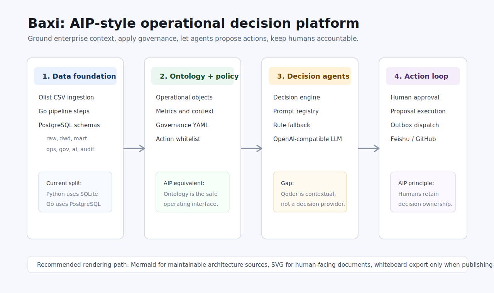
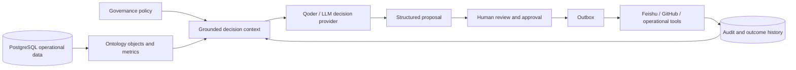

# Baxi AIP 理念对齐与项目审查报告

生成时间：2026-05-26 22:09（Asia/Shanghai）  
审查分支：`migration/go-postgres`  
审查范围：Go 后端、Python FastAPI 网关、React 前端、迁移脚本、治理配置、测试与架构文档。

## 1. 结论摘要

Baxi 的方向与 Palantir AIP 的核心理念是相近的：把业务对象、治理规则、操作动作和审计链路放在一个受控的运行环境里，让 LLM 或智能体只在被授权、可追踪、可解释的边界内提出或执行动作。当前项目已经有 Go pipeline、PostgreSQL schemas、治理配置、decision engine、review/outbox/action 这些骨架，但还没有形成完整的 AIP 式闭环。

主要缺口有三类：

1. 决策智能体尚未真正接入 Qoder 这类 LLM。当前 Go 端只有 rule-based 和 OpenAI-compatible provider，Qoder 更多是上下文/report API，不是决策 provider。
2. Python/SQLite 与 Go/PostgreSQL 两套平台并行，React 前端仍主要走 Python gateway，导致新 Go 决策/治理能力没有成为主路径。
3. 关键数据库迁移、action whitelist、outbox worker 和 API action execution 存在会影响生产闭环的 bug。

## 2. Palantir AIP 理念提炼

官方资料来源：

- Palantir AIP overview: https://www.palantir.com/docs/foundry/aip/overview/
- Palantir AIP capabilities: https://www.palantir.com/docs/foundry/platform-overview/aip-capabilities/
- AIP Logic: https://www.palantir.com/docs/foundry/aip/aip-logic/
- AIP Assist: https://www.palantir.com/docs/foundry/assist/overview/
- AIP ethics and governance: https://www.palantir.com/docs/foundry/aip/ethics-governance/

从这些官方材料看，AIP 的工程理念可以概括为：

| 理念 | 含义 | 对 Baxi 的要求 |
|---|---|---|
| Ontology 作为操作接口 | LLM 不直接碰散乱数据，而是通过业务对象、属性、关系、动作理解企业运行状态 | 建立稳定的 Olist 业务对象模型，并让决策上下文、权限、动作都基于 ontology |
| Grounded AI | 智能体必须基于真实业务数据、指标、历史和策略做推理 | 决策 prompt 应由 PostgreSQL、治理规则、审计历史和 action policy 拼装 |
| Human-in-the-loop | AI 提建议，关键影响由人负责和批准 | review/proposal/approval/outbox 必须成为强约束，不是旁路功能 |
| Governed actions | action 是可授权、可审计、可回滚或可补偿的工具 | action registry、whitelist、dry-run、dispatch、audit 要一致 |
| Operational feedback | 执行结果回写系统，形成持续改进闭环 | outbox delivery result、case outcome、metric impact 应回写并进入后续 context |

## 3. 当前架构图

面向阅读的 SVG 图：

可维护的 Mermaid 源文件：

- [系统架构 Mermaid](../diagrams/2026-05-26T220918/baxi-system-architecture.mmd)
- [决策闭环 Mermaid](../diagrams/2026-05-26T220918/baxi-decision-loop.mmd)

当前运行形态可以理解为四层：

1. 数据层：Go pipeline 将 CSV 加载进 PostgreSQL 的 `raw/dwd/mart/ops/gov/ai/audit` schemas；Python 服务仍使用 SQLite。
2. 治理层：`config/*.yml`、`internal/governance`、`internal/decision`、`internal/action` 共同定义规则、上下文、可执行动作。
3. API 层：Python FastAPI 暴露前端主路径；Go chi API 暴露迁移中的治理、决策、outbox、action 能力。
4. 人机协同层：React console、review service、outbox worker、Feishu/GitHub adapter 构成审批和执行通道。

## 4. 渲染方式建议

最简单、最适合本项目长期维护的方式是 Mermaid：

- 优点：纯文本、可 diff、容易嵌入 Markdown、适合架构图和时序图。
- 缺点：视觉精细度有限，复杂布局受 Mermaid renderer 影响。

面向汇报文档建议补充 SVG：

- 优点：不用依赖 Mermaid runtime，Markdown、浏览器、飞书文档通常都能稳定显示。
- 缺点：手写维护成本高，复杂改动不如 Mermaid 方便。

飞书画板适合最终发布到协作空间，但本环境中 `@larksuite/whiteboard-cli` 下载/渲染路径未能稳定完成，所以本次先交付 Mermaid + SVG。本质上这是更稳的本地文档路径。

## 5. 审查方法与测试结果

已执行检查：

| 检查 | 结果 |
|---|---|
| `frontend/npm run build` | 通过 |
| `frontend/npm test -- --run` | 通过，9 个文件、33 个测试 |
| `go test ./... -count=1` | 失败，集中在 `test/integration` 3 个失败 |
| `go vet ./...` | 通过 |
| `pytest -q` | 超时，卡在 API gateway 相关测试 |
| `pytest tests/test_alert_service_extended.py -q --no-cov` | 通过，24 个测试 |
| `ruff check api services adapters core` | 失败，19 个生产代码 lint 错误 |

## 6. 高优先级 bug

| 优先级 | 位置 | 问题 | 影响 |
|---|---|---|---|
| P0 | `migrations/005_ops_tables.sql` + `internal/outbox/repository.go` | Go outbox repository 查询/更新 `next_retry_at`，但 canonical migration 没有该列 | worker dispatch 在真实迁移库上失败，集成测试 `TestPhase7_WorkerDispatch` 复现 |
| P0 | `migrations/010_ai_tables_enhance.sql` | `ai.decision_case(source_type, source_id)` 使用 `NOT NULL DEFAULT ''` 并建 active unique index | 未显式设置 source 的多个 active case 会全部冲突，集成测试 `TestPhase7_ConcurrentApprovals` 复现 |
| P0 | `internal/action/registry.go` | 配置 `actions: {}` 时仍自动加入所有 canonical actions | whitelist 无法真正禁用内置动作，集成测试 `TestPhase7_Whitelist_NonWhitelistedAction` 复现 |
| P0 | `internal/api/server.go` | API action execute 使用 `action.NewApplyService(nil, nil, ...)` | API 真实执行 proposal 时没有 Feishu/GitHub executor，action 闭环不可用 |
| P1 | `internal/api/server.go` | server 构造函数忽略传入 `cfg`，直接读环境变量 | 配置加载默认值和测试注入失效，可能导致 CORS 默认值丢失或 auth 行为不一致 |
| P1 | `internal/api/server.go` | 手动 outbox dispatch endpoint 总是 `dryRun=true` | API 上看似 dispatch，实际无法真实发送；和 worker 行为不一致 |
| P1 | `internal/repository/ontology_repository.go` vs migrations | ontology repository 查询 `total_payment_value/customer_city/delivery_status/seller_city/review_score` 等迁移表不存在的列 | 真实 PostgreSQL ontology context 构建会失败，测试表掩盖了迁移漂移 |
| P1 | Python pytest API gateway | `TestClient.get("/api/v1/health")` 在 pytest 下阻塞，但手工脚本可返回 200 | CI 会卡死或超时，说明 pytest/anyio/TestClient/fixture 隔离存在问题 |
| P1 | `cmd/baxi-cli/decision.go`, `cmd/baxi-cli/llm.go` | CLI 使用硬编码 `localhost:8080`、无 bearer token、无 timeout | API 开启认证后 CLI 命令不可用，网络异常可能长时间挂起 |
| P1 | `frontend/vite.config.ts`, `frontend/src/api/client.ts` | 前端 dev proxy 指向 Python `:8765`，不是 Go `:8080` | 新 Go 决策/治理/LLM API 没有进入主界面路径 |

## 7. 中低优先级问题

| 优先级 | 位置 | 问题 | 影响 |
|---|---|---|---|
| P2 | `internal/api/handler/action.go` | response struct 有 `OutboxEventID`，但 never populated | 前端或调用方无法拿到 dispatch event id |
| P2 | `internal/llm/provider_factory.go` | 解析了 `LLM_FALLBACK_ENABLED` 和 `LLM_MAX_RETRIES`，但实际未按配置控制 fallback/retry | LLM 行为与配置表面含义不一致 |
| P2 | `internal/llm/openai_provider.go` | 直接 `json.Unmarshal(content)`，没有处理 fenced JSON 或附带解释文本 | 真实模型输出稍有包装就会失败 |
| P2 | `api/routers/qoder.py`, `api/schemas.py`, `api/schemas_qoder.py`, `services/*` | 生产 Python 代码 Ruff 失败 19 项 | CI 或质量门禁无法稳定通过 |
| P2 | `core/config.py` 与服务模块 | 多个服务 `from core.config import DB_PATH` 后按值持有路径 | 测试 monkeypatch 和运行时 DB 切换可能不生效 |
| P2 | `api/main.py` | rate limiter 新 bucket 初始 token 为 0 | 首次请求存在被限流风险 |
| P3 | repo root | Go binaries `baxi-api/baxi-cli/baxi-worker` 被提交或处于 dirty 状态 | 仓库噪音大，容易误提交构建产物 |
| P3 | `README.md` | README 仍偏旧 Olist 项目叙述，与 Go/PostgreSQL/AIP 迁移不一致 | 新成员理解成本高 |

## 8. AIP 对齐评估

| AIP 能力 | 当前 Baxi 状态 | 评价 |
|---|---|---|
| Enterprise ontology | 有 ontology repository/context builder 雏形，但 schema 漂移明显 | 需要先修 schema contract |
| Governed agent actions | 有 registry、whitelist、review、outbox | 核心链路有 bug，尚不能作为生产闭环 |
| Human review | 有 review/proposal/approval 服务 | 需要前端和 API 主路径打通 |
| LLM reasoning | 有 provider factory 和 prompt registry | 尚未接入 Qoder，fallback/retry 配置不完整 |
| Auditability | 有 audit schema 和 action audit 方向 | 需要把 LLM prompt、evidence、approval、dispatch result 串成同一 trace |
| Operational console | 有 React console | 仍连接 Python gateway，未承载 Go AIP 主能力 |

## 9. Qoder/LLM 接入建议

建议按最小闭环推进，而不是一次性替换所有决策逻辑：

1. 定义 `LLMProvider` 的 Qoder-compatible 实现，和现有 OpenAI-compatible provider 并列。
2. 统一 decision prompt 输入：case、ontology object、指标、治理规则、历史 action、候选 actions。
3. 强制结构化输出 schema：`recommendation`、`confidence`、`evidence`、`risk_flags`、`proposed_actions`、`requires_human_approval`。
4. 所有 LLM 输出先进入 review/proposal，不直接 dispatch。
5. 审批通过后再写 outbox，由 worker 执行，并把执行结果回写 case 和 audit。
6. 前端从 Python gateway 迁到 Go API 或建立清晰 BFF，避免两套 API 同时解释业务状态。

## 10. 修复路线图

第一阶段：修断链 bug。

- 给 `ops.outbox_events` migration 补 `next_retry_at`，并补真实迁移库集成测试。
- 调整 `ai.decision_case` source unique index：允许 NULL，或仅当 source 非空时建唯一索引。
- 修正 action whitelist 语义：显式空配置应为空；缺省配置才加载 canonical actions。
- API action execution 注入真实 executors，并返回 `OutboxEventID`。

第二阶段：统一主路径。

- 让 React console 的关键决策/治理页面走 Go API。
- 给 CLI 增加 base URL、bearer token、timeout。
- 修复 ontology repository 与 migrations 的列契约。
- 修复 Python pytest hang 和 Ruff 生产代码错误。

第三阶段：接入 Qoder。

- 新增 Qoder provider。
- 做 structured output validation。
- 将 prompt、evidence、policy result、approval、dispatch result 组成同一 audit trace。
- 增加 LLM contract tests 和 replay tests，确保同一 case 可复现。

## 11. 推荐目标架构

目标不是“让 LLM 直接管业务”，而是建立一个受控的操作系统：

这条链路和 AIP 的理念一致：LLM 是受治理的推理层，不是权限主体；业务对象、策略、人工审批、审计结果才是系统可信度的来源。
