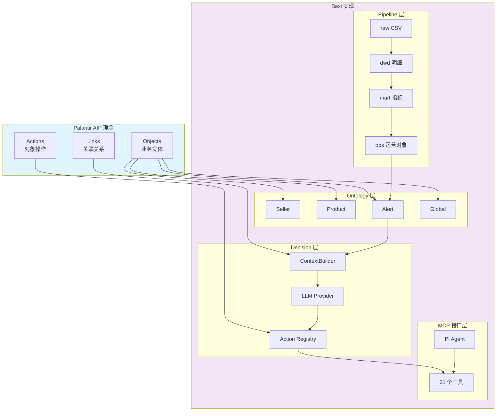
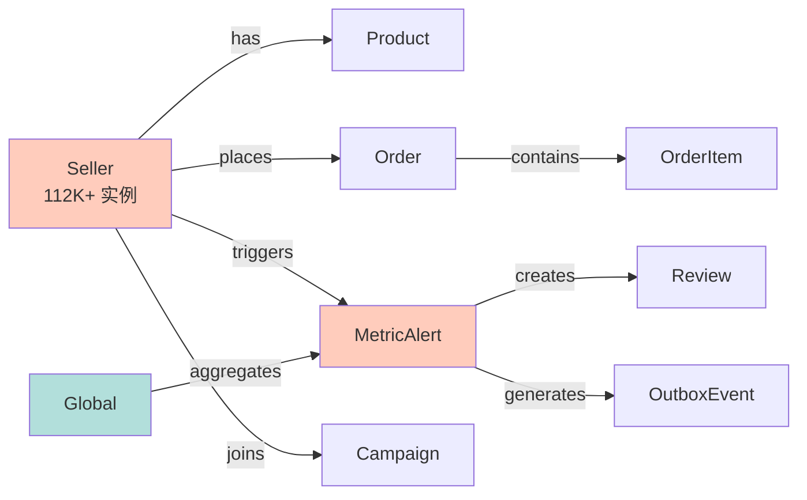
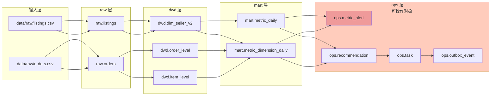
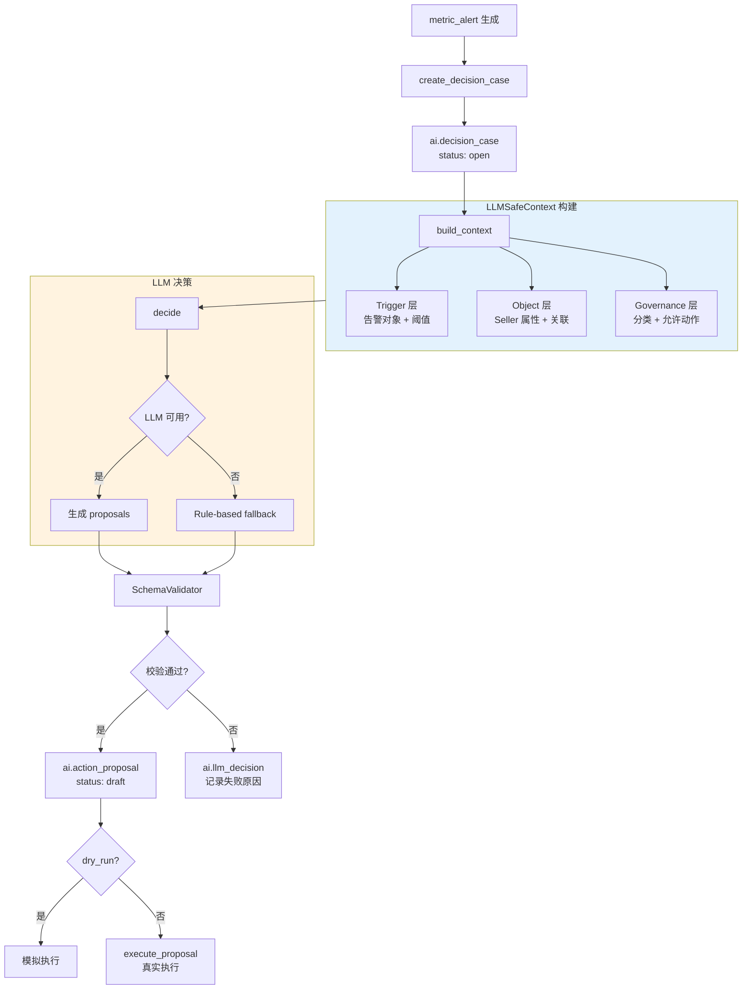
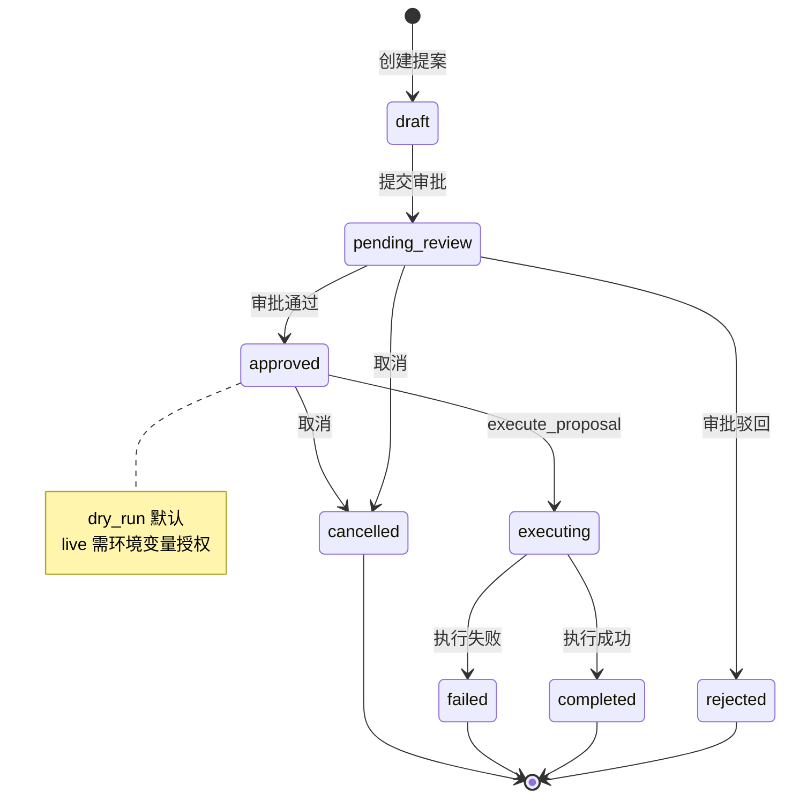

# Baxi 技术报告：基于 Palantir AIP 本体论的数据治理与决策平台

## 摘要

Baxi 是一个借鉴 Palantir AIP 本体论（Ontology）理念的数据治理与决策平台。它将业务实体——Seller、Product、Alert——作为系统设计的核心，通过数据管道构建对象、基于对象上下文进行 LLM 决策、绑定对象类型执行动作，形成完整的闭环系统。

系统包含 9 种本体对象类型、112,652 个 Seller 实例、9 步 ETL 管道、31 个 MCP 工具，以及端到端的决策生命周期：告警 → 案例 → 提案 → 审批 → 执行 → 结案。AI Agent（Pi）可以通过 stdio 接口直接操作业务对象，无需理解底层表结构。

**关键词**：本体论、数据治理、LLM 决策、MCP、Palantir AIP

---

## 第 1 章 引言：为什么借鉴 Palantir AIP

### 1.1 传统数据平台的语义丢失

传统数据平台以关系数据库为核心。数据存储在表中，业务语义散落在 SQL join、存储过程和报表配置中。分析师需要理解表结构才能提问，开发者需要追踪多个系统才能知道一个字段的血缘。

这种模型有三个根本问题：

**表与业务脱节**。`dwd.dim_seller_v2` 是一个技术名称，不是业务概念。新加入的工程师需要花数周才能理解每张表的业务含义。

**关系隐式化**。Seller 与 Order 的关联藏在 `seller_id` 外键中，需要查询的人才能发现。没有统一的地方查看"Seller 有哪些关联对象"。

**动作与数据分离**。BI 工具可以发现"Seller-123 的收入下降 30%"，但无法直接触发"通知 Seller-123 的负责人"。洞察与动作之间隔着人工翻译层。

### 1.2 Palantir AIP 的本体论洞见

Palantir AIP 提出了不同的设计哲学：**数据系统应该模拟现实世界的业务结构，而不是反过来让业务适应表结构**。

其核心概念有三层：

**Objects（对象）**：Seller、Order、Alert 不是表，是业务实体。每个对象有类型定义（schema）、唯一标识（primary key）、属性（properties）和关联（links）。

**Links（关联）**：对象之间的关系是显式的、可查询的。"Seller-123 有哪些 Order"是一个本体查询，不是 SQL join。

**Actions（动作）**：每个对象类型绑定一组可执行的操作。`notify_owner(seller)`、`escalate(alert)` 是对象的方法，不是独立的 API。

这种设计的本质是**把业务语义提升到系统架构层**。对象、关联、动作构成一个自描述的系统，AI Agent 可以直接理解和操作。

### 1.3 Baxi 的目标与取舍

Baxi 的目标是构建一个可演示的、本体论驱动的数据治理闭环。它不是企业级产品，而是一个**概念验证**：证明一个小团队可以用本体论理念，在有限时间内构建出 Agent 可操作的数据平台。

因此，我们在设计上做了明确的取舍：

- **不求规模，求完整**。单机 PostgreSQL 即可运行，不求分布式架构。
- **不求实时，求可控**。CSV 批处理代替流式计算，便于复现和调试。
- **不求通用，求贯通**。4 种标准动作覆盖核心场景，不求无限扩展。

### 1.4 报告结构

本文档围绕"本体论驱动设计"这一主线，依次展开：

- 第 2 章：Ontology 设计——业务实体如何成为一等公民
- 第 3 章：Pipeline——从原始数据到本体对象的转化
- 第 4 章：Decision Engine——基于本体上下文的智能决策
- 第 5 章：Action System——本体绑定的操作执行
- 第 6 章：Governance——嵌入对象层的元数据治理
- 第 7 章：MCP 接口——本体能力的对外暴露
- 第 8 章：验证与测试——本体驱动的端到端验证
- 第 9 章：取舍与局限——设计决策的回顾
- 第 10 章：结论

### 架构概览



---

## 第 2 章 Ontology 设计：业务实体的一等公民化

### 2.1 对象类型体系

Baxi 定义了 9 种核心对象类型，覆盖数据治理和决策的主要业务域：

| 对象类型 | 业务含义 | 典型实例数 | 数据来源 |
|---------|---------|-----------|---------|
| seller | 商家/卖家 | 112,652 | raw.listings |
| product | 商品 | 可变 | raw.listings |
| metric_alert | 指标告警 | 动态生成 | mart.metric_daily |
| global | 全局指标 | 1 | mart.metric_daily |
| campaign | 营销活动 | 可变 | 外部导入 |
| order | 订单 | 可变 | raw.orders |
| order_item | 订单明细 | 可变 | raw.orders |
| review | 审批记录 | 动态生成 | ai.review_record |
| outbox_event | 待分发事件 | 动态生成 | ops.outbox_event |

对象类型的设计遵循"业务语义优先"原则。例如 `metric_alert` 不是一张告警表，而是一个"当某个对象的指标超出阈值时自动生成的对象"。它有 `current_value`、`baseline_value`、`change_rate` 等属性，也有指向触发对象（seller 或 global）的 link。

### 2.2 ObjectTypeV2 Schema 定义

每个对象类型的结构在 `config/aip_object_schema.yml` 中定义，采用静态 Schema 模式：

```yaml
object_types:
  seller:
    display_name: "Seller"
    primary_key: "seller_id"
    properties:
      seller_id:
        type: "string"
        nullable: false
      revenue_7d:
        type: "float"
        nullable: true
      owner_role:
        type: "string"
        nullable: true
    links:
      orders:
        target_type: "order"
        relation: "seller_id"
      products:
        target_type: "product"
        relation: "seller_id"
    actions:
      - "notify_owner"
      - "create_task"
      - "apply_tag"
```

Schema 包含四个核心部分：

**primary_key**：对象的唯一标识。所有本体操作都基于 primary_key 定位对象。

**properties**：对象属性列表。每个属性有类型、可空性、以及可选的 governance 分类标记（PII、财务、运营等）。

**links**：关联对象定义。links 不是外键约束，而是语义关联。`seller.orders` 表示"这个 seller 的所有订单"，系统会自动生成查询逻辑。

**actions**：对象支持的动作列表。动作不是全局函数，是绑定到特定对象类型的操作。`notify_owner` 对 seller 和 alert 都可用，但语义不同：前者通知商家负责人，后者通知告警对象 owner。

### 2.3 从关系模型到对象模型

传统查询方式：

```sql
SELECT s.seller_id, s.revenue_7d, s.owner_role,
       COUNT(o.order_id) as order_count
FROM dwd.dim_seller_v2 s
LEFT JOIN dwd.order_level o ON s.seller_id = o.seller_id
WHERE s.seller_id = 'SELLER-123';
```

本体查询方式：

```go
obj, err := ontologySvc.GetObject(ctx, "seller", "SELLER-123")
// obj.Properties["revenue_7d"]
// obj.Links["orders"] → []*Order
```

两种方式的差异不仅是语法糖。本体查询返回的是一个**完整的业务对象**，包含属性、关联、治理信息、可用动作。调用方不需要知道表名、不需要写 join、不需要理解字段含义。

### 2.4 静态 Schema 的取舍

Baxi 选择了静态 YAML 定义，而非动态 schema 演进。这是演示阶段的刻意取舍：

**选择静态的理由**：
- 确定性：对象结构在启动时固定，Agent 可以依赖稳定的接口
- 简单性：无需 schema 版本管理、迁移协调、兼容性处理
- 安全性：防止运行时对象定义被恶意修改

**放弃动态的能力**：
- 新增对象类型需要改 YAML、重启服务
- 无法根据数据自动发现新对象类型
- 不支持用户自定义对象（仅限预定义的 9 种）

**演进路径**：生产环境可以引入动态 schema，通过 migration 系统管理对象定义的版本。当前静态模式是为了在概念验证阶段保持聚焦。

### Ontology 对象关系图



---

## 第 3 章 Pipeline：从原始数据到本体对象的转化

### 3.1 Pipeline 的设计定位

Baxi 的 Pipeline 不是通用 ETL 工具，而是**本体构建器**。每一步都有明确的语义目标：产出某种对象类型或对象状态。

9 步管道的设计映射如下：

| 步骤 | 技术名称 | 本体语义 | 产出对象 |
|------|---------|---------|---------|
| 1 | ingest_raw | 原始数据录入 | raw 层记录 |
| 2 | build_dwd_order | 订单对象构建 | order / order_item |
| 3 | build_dwd_item | 商家对象构建 | seller / product |
| 4 | build_metric_daily | 日指标计算 | global（全局对象） |
| 5 | build_metric_dimension | 维度指标计算 | seller 属性更新 |
| 6 | detect_alerts | 异常检测 | metric_alert（告警对象） |
| 7 | generate_recommendations | 建议生成 | recommendation |
| 8 | generate_tasks | 任务生成 | task |
| 9 | create_outbox | 事件分发准备 | outbox_event |

每一步都遵循"单步事务"模式：runner 为每个 step 创建独立的 pgx.Tx，成功则 commit，失败则 rollback 并中止整个管道。

### 3.2 语义层级：raw → dwd → mart → ops

数据在管道中经历四个语义层级，每一层都更接近"业务对象"：

**raw 层**：原始 CSV 数据，无业务语义。`raw.listings` 只是 listing 文件的镜像。

**dwd 层（Data Warehouse Detail）**：数据仓库明细层。`dwd.dim_seller_v2` 已经是结构化的 seller 属性表，但仍是关系模型。

**mart 层（Data Mart）**：数据集市层。`mart.metric_daily` 和 `mart.metric_dimension_daily` 计算了 seller 的聚合指标（7 日收入、同比变化等）。这些指标成为 seller 对象的动态属性。

**ops 层（Operations）**：运营层。`ops.metric_alert`、`ops.recommendation`、`ops.task` 是直接从业务规则生成的**可操作对象**。metric_alert 不是报表，是一个具有 `current_value`、`threshold`、`status`、`owner_role` 的本体对象。

### 3.3 批处理架构的取舍

Baxi 使用 CSV 批处理而非实时流式计算。这是关键的设计取舍：

**选择批处理的理由**：
- **可控性**：开发者可以精确控制输入数据，便于复现问题
- **简单性**：无需 Kafka、Flink 等流式基础设施
- **成本**：单机 PostgreSQL 即可运行全部管道

**具体实现**：
- 默认数据目录：`./data/raw/`
- MCP 工具 `run_pipeline` 支持 `data_dir` 参数指定自定义路径
- Pipeline Runner 在 30 分钟超时内顺序执行所有步骤

**放弃的实时能力**：
- 无法演示"数据变更 → 实时告警"的场景
- 数据新鲜度取决于 CSV 更新频率
- 不支持 CDC（Change Data Capture）

**演进路径**：生产环境可以替换为流式架构。当前批处理模式是为了让概念验证可独立运行，不依赖外部基础设施。

### 3.4 Pipeline 与 Ontology 的衔接

管道的最终产出是**可操作的 Ontology 对象**，而非静态报表。

`detect_alerts` 步骤的逻辑示例：

```go
// 扫描 mart.metric_dimension_daily
// 对每个 seller，检查 revenue_7d_change_rate < -0.2
// 如果满足条件，创建 metric_alert 对象

alert := &MetricAlert{
    ObjectType:    "seller",
    ObjectID:      sellerID,
    MetricName:    "revenue_7d",
    CurrentValue:  currentRevenue,
    BaselineValue: baselineRevenue,
    ChangeRate:    changeRate,
    Severity:      "high",
    Status:        "open",
}
// 写入 ops.metric_alert，同时注册为本体实例
```

这种设计使得**告警不是日志，是对象**。Agent 可以查询告警对象、获取关联的 seller 对象、执行绑定的 notify_owner 动作——全程使用本体语义，无需接触 SQL。

### Pipeline 数据流图



---

## 第 4 章 Decision Engine：基于本体上下文的智能决策

### 4.1 传统决策系统的两种极端

决策系统通常走向两个极端：**纯规则引擎**或**纯 LLM 生成**。两者各有致命缺陷。

**纯规则引擎**：用 if-else 硬编码所有场景。当业务出现新异常模式时，需要人工编写新规则。规则数量膨胀后，维护成本和冲突检测成为噩梦。

**纯 LLM 生成**：直接让模型根据原始数据做决策。问题在于幻觉——模型可能推荐系统不存在的动作，或者对没有权限的数据提出操作。没有约束的自由是危险的。

Baxi 的解法是**Ontology 上下文 + LLM 生成 + 规则校验**的三层架构。LLM 负责理解复杂场景和生成创造性方案，Ontology 提供约束边界，规则引擎做最终校验。

### 4.2 LLMSafeContext 的三层构建

决策的输入不是原始数据，而是一个经过精心构建的**安全上下文**（LLMSafeContext）。它包含三层信息：

**Trigger 层**：为什么需要决策？

```go
type TriggerInfo struct {
    AlertID       string
    ObjectType    string  // "seller"
    ObjectID      string  // "SELLER-123"
    MetricName    string  // "revenue_7d"
    CurrentValue  float64 // 85000
    BaselineValue float64 // 120000
    ChangeRate    float64 // -0.29
    Severity      string  // "high"
}
```

Trigger 层告诉模型："Seller-123 的 7 日收入从 120K 降到 85K，降幅 29%，触发 high 级别告警"。

**Object 层**：决策针对谁？

```go
type ObjectContext struct {
    Type       string
    ID         string
    Properties map[string]interface{}
    Links      map[string][]LinkedObject
}
```

Object 层提供目标的完整画像。对 Seller-123，模型可以看到：收入趋势、订单量、商品数、负责人角色、关联的订单列表、关联的商品列表。这些是**本体语义化的对象视图**，不是原始表数据。

**Governance 层**：允许做什么？

```go
type GovernanceInfo struct {
    Classification string   // "PII"
    AllowedActions []string // ["notify_owner", "create_task"]
    ForbiddenActions []string // ["delete", "escalate"]
    AccessPolicy   string   // "owner_only"
}
```

Governance 层是安全边界。它明确告诉模型：这个 seller 的数据分类是 PII，你只能推荐 notify_owner 或 create_task，不能推荐 delete 或 escalate。Owner_only 策略意味着只有负责人可以操作。

### 4.3 ContextBuilderV2 的 Ontology 感知

ContextBuilderV2 是连接 Ontology 和 LLM 的桥梁。它的构建流程：

```
1. 从 ai.decision_case 读取案例 → 解析 object_type + object_id
2. 调用 ontologyRepo.GetObjectByID(ctx, pool, object_type, object_id)
   → 获取对象的完整属性（含动态指标）
3. 调用 governance.MarkingService.GetMarkings(object_type, field_paths)
   → 获取字段级别的分类信息
4. 调用 actionRegistry.GetAllowedActions(object_type)
   → 获取对象类型允许的动作列表
5. 如果 case 关联了 alert_id，获取告警对象作为 trigger
6. 组装 LLMSafeContext，传递给 LLM provider
```

关键设计：ContextBuilder 不直接查询数据库表，而是通过 **Ontology 接口**获取对象。这意味着：

- 如果 Ontology 层未来支持缓存或联邦查询，ContextBuilder 自动受益
- 对象属性的计算逻辑（如 revenue_7d 的聚合方式）封装在 Ontology 层
- 新增对象类型只需扩展 Ontology 定义，无需修改决策逻辑

### 4.4 决策流程与状态转换

一个完整的决策生命周期：

```
metric_alert 生成
  → create_decision_case(alert_id)
    → ai.decision_case 状态: "open"
      → build_context(case_id)
        → LLMSafeContext 组装完成
          → decide(case_id)
            → LLM 生成 proposals
              → schema_validator 校验 proposals
                → 存储到 ai.action_proposal
                  → case 状态: "decided"
```

**decide 阶段的具体逻辑**：

1. 调用 LLM provider（OpenAI 或 rule-based fallback）
2. LLM 接收 LLMSafeContext，生成 JSON 格式的提案列表
3. SchemaValidator 校验每个提案：
   - action_type 是否在 allowed_actions 中？
   - 参数是否符合 action schema？
   - 风险等级是否在可接受范围？
4. 校验通过的提案写入 ai.action_proposal 表
5. 失败的提案记录到 ai.llm_decision 表供审计

### 4.5 取舍：LLM 成本与规则覆盖

Baxi 在决策层做了三个关键取舍：

**LLM 为主，规则为 fallback**

默认使用 LLM（gpt-4o-mini）生成决策。当 LLM 不可用（网络故障、API 限额）或返回无效结果时，自动回退到 rule-based provider。Rule-based provider 根据预定义规则生成提案，不依赖外部服务。

**dry_run 为默认，live 需显式授权**

所有 execute_proposal 调用默认执行 dry_run（模拟执行）。只有设置了 `BAXI_ALLOW_LIVE_EXECUTION=true` 环境变量，才能执行真实操作。这是防止 Agent 在测试阶段误操作的安全阀。

**决策上下文大小限制**

LLMSafeContext 会过滤敏感字段（根据 classification 标记），并限制关联对象的数量（默认最多 10 个关联订单）。这是为了防止上下文过长导致 LLM 性能下降或成本激增。

### 4.6 可解释性设计

每个决策都有完整的审计链路：

- `ai.decision_case`：案例创建时间、关联告警、目标对象
- `ai.llm_decision`：LLM 的原始输入（LLMSafeContext）、原始输出（JSON proposals）、校验结果
- `ai.decision_lineage`：每个状态转换的记录（open → decided → approved → executing → closed）

Agent 可以回答"为什么推荐 notify_owner？"——因为 lineage 记录了完整的上下文：Seller-123 的收入下降 29%，告警级别 high，允许的动作为 [notify_owner, create_task]，LLM 基于这些输入生成了提案。

### 决策流程图



---

## 第 5 章 Action System：本体绑定的操作执行

### 5.1 Action Registry：对象操作的类型系统

Action Registry 是本体论理念在执行层的体现。动作不是全局函数，是**绑定到特定对象类型的操作**。

Baxi 定义了 4 种标准动作类型：

| 动作 | 适用对象 | 语义 | 执行方式 |
|------|---------|------|---------|
| notify_owner | seller, alert | 通知对象负责人 | Feishu webhook / 邮件 |
| create_task | seller, alert | 创建跟踪任务 | 内部 task 表 |
| apply_tag | seller, product | 给对象打标签 | 更新对象属性 |
| escalate | alert | 升级告警级别 | 更新告警状态 + 通知上级 |

每种动作有明确的 schema 定义（参数类型、必填字段、默认值），存储在 `config/action_registry.yml`。

### 5.2 为什么限制为 4 种动作

Baxi 故意限制了动作数量。这是安全与灵活性的权衡：

**限制的理由**：
- **安全边界**：Agent 只能执行预定义的安全动作，无法请求"删除数据库"或"修改密码"
- **可控性**：每种动作有明确的 schema 和适配器实现，开发者可以精确控制行为
- **可解释性**：4 种动作的含义清晰，审批者可以快速理解提案的影响

**放弃的能力**：
- 用户无法自定义动作类型
- 不支持任意 SQL 或 shell 命令
- 动作的参数结构固定，无法动态扩展

**演进路径**：生产环境可以引入动作插件系统，允许注册自定义动作。当前 4 种动作覆盖了数据治理中最常见的场景：通知、跟踪、标记、升级。

### 5.3 Proposal → Approval → Execution 状态机

动作执行遵循严格的状态机，确保每一步都可审计、可回滚：

```
draft（草稿）
  → pending_review（待审批）
    → approved（已审批）→ executing（执行中）→ completed（已完成）
    → rejected（已驳回）
  → cancelled（已取消）
```

**状态转换规则**：

- draft → pending_review：提案创建者提交
- pending_review → approved：有权限的审批者通过 `approve_proposal`
- pending_review → rejected：审批者驳回，需填写原因
- approved → executing：调用 `execute_proposal`
- executing → completed：执行适配器返回成功
- 任何状态 → cancelled：提案创建者或管理员取消

**关键设计**：执行和审批分离。即使 LLM 生成了提案，也需要人工（或更高权限的 Agent）审批后才能执行。这是防止自动化错误的最后一道防线。

### 5.4 沙箱机制：操作的安全验证

Baxi 引入了沙箱（Sandbox）概念，用于在真实执行前验证提案的影响：

```
create_sandbox(case_id)
  → 创建隔离的测试环境
    → add_to_sandbox(sandbox_id, proposal_id)
      → 在沙箱中模拟执行提案
        → get_sandbox(sandbox_id)
          → 查看模拟结果
            → compare_sandboxes(sandbox_id_1, sandbox_id_2)
              → 对比不同方案的影响差异
```

沙箱的实现是**逻辑隔离**而非物理隔离。它在同一个数据库中运行，但使用事务 rollback 来避免副作用。提案在沙箱中的执行会被回滚，但执行日志和模拟结果会被保存供对比。

**取舍**：逻辑隔离简单高效，但不适用于有外部副作用的动作（如发送真实邮件）。因此沙箱主要用于验证数据变更类动作（apply_tag、create_task），不适用于 notify_owner（会真实发送通知）。

### 5.5 执行适配器

Baxi 实现了 5 种执行适配器，覆盖不同的通知渠道：

- **FeishuAdapter**：飞书 webhook，发送卡片消息到指定群
- **GitHubAdapter**：创建 GitHub issue，用于技术问题跟踪
- **CLIAdapter**：本地命令执行，用于调试和开发
- **ManualAdapter**：人工确认执行，生成待办任务等待人工点击
- **NoOpExecutor**：空操作，用于测试和 dry_run

适配器的选择在运行时根据动作配置决定。例如 `notify_owner` 默认使用 FeishuAdapter（如果配置了 webhook URL），否则回退到 ManualAdapter。

### 动作状态机图



---

## 第 6 章 Governance：嵌入对象层的元数据治理

### 6.1 为什么治理要嵌入 Ontology

传统数据治理是外部系统。Apache Atlas、Alation 等工具通过扫描数据库元数据来构建治理目录。这种模式的缺点是**治理与数据分离**：分析师在 BI 工具中看不到字段的分类标记，开发者在写 SQL 时不知道某个字段是 PII。

Baxi 的做法是将 governance 信息**嵌入对象层**，成为对象属性的一部分。当 Agent 查询 seller 对象时，自动获得：

- 哪些字段是 PII？
- 谁可以访问这个对象？
- 这个对象的数据来源是什么？
- 允许对它执行哪些动作？

这种设计的本质是**治理即代码**。分类、血缘、策略不是独立系统的配置，是对象 schema 的一部分。

### 6.2 数据分类（Classification）

Baxi 在字段级别实现数据分类。每个对象类型的属性可以标记分类级别：

```yaml
properties:
  seller_id:
    classification: "public"
  revenue_7d:
    classification: "financial"
  owner_email:
    classification: "PII"
```

分类级别包括：public（公开）、internal（内部）、financial（财务）、PII（个人身份信息）。

分类信息在多个环节发挥作用：

- **ContextBuilder**：构建 LLMSafeContext 时，自动过滤 PII 字段（除非 Agent 有显式权限）
- **ActionRegistry**：某些动作（如 notify_owner）对 PII 对象需要额外审批
- **AuditLog**：记录谁访问了 PII 数据，用于合规审计

### 6.3 血缘追踪（Lineage）

血缘追踪回答"这个数据从哪来"。Baxi 在对象级别实现血缘：

```
data/raw/sellers.csv
  → raw.listings
    → dwd.dim_seller_v2
      → mart.metric_dimension_daily
        → ops.metric_alert
          → ai.decision_case
            → ai.action_proposal
```

每个对象实例都记录其来源信息。例如 metric_alert 对象知道："我是从 mart.metric_dimension_daily 的 seller-123 记录生成的，检测规则是 revenue_drop_threshold"。

血缘信息存储在 `gov.data_lineage` 表，通过 `governance.LineageService` 查询。Agent 可以问："这个告警的数据来源是什么？"——系统会返回完整的血缘链路。

### 6.4 访问策略（Access Policy）

访问策略定义"谁可以对这个对象做什么"。Baxi 实现了基于角色的策略模型：

```yaml
access_policies:
  - role: "data_analyst"
    object_types: ["seller", "product"]
    actions: ["view", "search"]
    fields: ["seller_id", "revenue_7d", "order_count"]
  - role: "ops_manager"
    object_types: ["seller", "alert"]
    actions: ["view", "search", "notify_owner", "escalate"]
    fields: ["*"]
```

策略在三个层面生效：

- **API 层**：handler 根据调用者角色过滤返回字段
- **MCP 层**：工具调用前检查 `check_access(role, object_type, action)`
- **Action 层**：执行前验证审批者是否有权限批准该动作

**取舍**：当前策略是静态 YAML 配置，不支持动态修改。生产环境需要策略引擎支持运行时更新、继承、冲突检测。

---

## 第 7 章 MCP 接口：本体能力的对外暴露

### 7.1 为什么用 MCP 而不是 REST API

Baxi 的核心用户是 AI Agent（Pi），不是人类开发者。传统 REST API 需要 Agent 理解 HTTP 方法、路径、请求体格式，然后将业务意图翻译为技术调用。这种翻译层是脆弱的——Agent 可能调用错误的 endpoint，或者构造错误的参数。

MCP（Model Context Protocol）是专门为 AI Agent 设计的协议。它通过 stdio 传输，提供**工具调用**语义：Agent 描述意图，系统返回结构化结果。没有 HTTP 方法、没有路径参数、没有状态码翻译。

Baxi 的 MCP Server 暴露了 31 个工具，按业务域分组：

| 域 | 工具数 | 核心工具 |
|----|-------|---------|
| decision | 6 | create_case, decide, resolve_case, list_cases, get_case, list_proposals |
| ontology | 4 | describe_ontology, get_object, get_linked_objects, execute_action |
| review | 5 | approve_proposal, reject_proposal, get_proposal_by_id, list_review_records, cancel_proposal |
| action | 2 | execute_proposal, get_decision_context |
| alert | 1 | list_alerts |
| pipeline | 1 | run_pipeline |
| governance | 2 | check_access, get_classification |
| status | 2 | get_system_status, search_objects |
| outbox | 2 | list_outbox_events, get_pipeline_status |
| sandbox | 4 | create_sandbox, add_to_sandbox, get_sandbox, compare_sandboxes |
| schema | 2 | list_action_schemas, get_action_schema |

### 7.2 工具即本体操作

每个 MCP 工具都对应一种**本体操作**。这不是巧合，是有意设计。

```
decide(case_id)              → 对 decision_case 对象执行"决策"操作
get_object(type, id)         → 查询本体对象实例
get_linked_objects(type, id) → 查询对象的关联对象
execute_action(type, id, action) → 对对象执行绑定的动作
```

工具的参数设计遵循本体语义：

- `create_decision_case` 的参数是 `alert_id`，不是 `raw_alert_row_id`。因为 Agent 操作的是告警对象，不是数据库行。
- `execute_proposal` 的参数是 `proposal_id` 和 `dry_run`，不是 SQL update 语句。因为 Agent 操作的是提案对象，不是直接修改表。

### 7.3 Pi Agent 的交互模式

Pi Agent 与 Baxi 的交互是**意图驱动**的：

**人类语言**："Seller-123 的收入下降了，通知他的负责人。"

**Agent 翻译**：
1. `search_objects("seller", "123")` → 找到 seller 对象
2. `list_alerts(object_type="seller", object_id="SELLER-123")` → 查看是否有相关告警
3. `create_decision_case(alert_id="ALERT-456")` → 从告警创建案例
4. `decide(case_id="DC-789")` → 生成决策提案
5. `approve_proposal(proposal_id="PROP-012", reviewer_id="pi_agent")` → 审批
6. `execute_proposal(proposal_id="PROP-012", dry_run=false)` → 执行

Agent 不需要知道：
- `ai.decision_case` 表的 schema
- `action_proposal` 和 `review_record` 之间的外键关系
- `notify_owner` 的实现是 Feishu webhook 还是邮件

Agent 只需要理解业务对象和本体操作。

### 7.4 stdio 传输的取舍

Baxi 的 MCP Server 使用 stdio 传输，这是 Palantir AIP 的默认模式，也是当前最简化的部署方式。

**选择 stdio 的理由**：
- **零网络配置**：本地进程间通信，无需端口、TLS、防火墙规则
- **低延迟**：无 HTTP 握手、无序列化开销
- **安全**：Agent 和 Server 运行在同一台机器，无网络暴露面

**stdio 的局限**：
- **仅限本地**：无法远程连接，Agent 和 Server 必须在同一主机
- **单连接**：同一时间只能有一个 Agent 连接
- **无内置认证**：依赖环境变量 `BAXI_MCP_USER_ID` 和 `BAXI_MCP_ROLE` 标识调用者身份

**演进路径**：生产环境可以扩展为 SSE（Server-Sent Events）或 HTTP POST 传输，支持远程连接和多 Agent 并发。

### MCP 工具架构图

```mermaid
flowchart TB
    subgraph Agent["Pi Agent"]
        I[自然语言意图]
    end

    subgraph MCP["MCP Server<br/>31 个工具"]
        subgraph D["decision 域"]
            DC[create_case]
            DE[decide]
            RC[resolve_case]
        end

        subgraph O["ontology 域"]
            GO[get_object]
            GLO[get_linked_objects]
            EO[execute_action]
        end

        subgraph R["review 域"]
            AP[approve_proposal]
            RP[reject_proposal]
            GP[get_proposal]
        end

        subgraph A["action 域"]
            EP[execute_proposal]
            GD[get_decision_context]
        end

        subgraph Others["其他域"]
            LA[list_alerts]
            RP2[run_pipeline]
            CA[check_access]
            SS[get_system_status]
            SO[search_objects]
            SB[create_sandbox]
        end
    end

    subgraph Services["业务服务"]
        DS[DecisionService]
        OS[OntologyService]
        RS[ReviewService]
        AS[ActionService]
    end

    I --> MCP
    DC --> DS
    DE --> DS
    RC --> DS
    GO --> OS
    GLO --> OS
    EO --> OS
    AP --> RS
    RP --> RS
    GP --> RS
    EP --> AS
    GD --> AS
    LA --> DS
    RP2 --> Pipeline
    CA --> Governance
    SS --> Status
    SO --> Ontology
    SB --> Sandbox

    style Agent fill:#e8f5e9
    style MCP fill:#e3f2fd
```



---

## 第 8 章 验证与测试：本体驱动的端到端验证

### 8.1 E2E 测试的 Ontology 视角

传统 E2E 测试验证 API 返回值："调用 create_case 返回 200，响应体包含 case_id"。这种测试无法验证**业务语义是否正确**。

Baxi 的 E2E 测试验证**对象状态的完整生命周期**：

```
metric_alert(告警对象) 存在
  → create_decision_case → ai.decision_case(案例对象) 创建成功
    → get_case → 案例状态为 "open"
      → decide → ai.action_proposal(提案对象) 生成
        → get_proposal_by_id → 提案状态为 "draft"
          → approve_proposal → review_record(审批记录) 生成
            → execute_proposal(dry_run) → execution_result(执行结果) 返回
              → resolve_case → 案例状态为 "closed"
```

测试通过的标准不是 HTTP 状态码，而是**对象状态是否正确转换**。

### 8.2 自适应测试设计

Baxi 的 E2E 测试是**自适应**的：它先探测系统状态，然后根据实际数据决定执行路径。

```go
// Phase 1: Probe
status := getSystemStatus()
if status.AlertCount == 0 {
    // Phase 2: Data Preparation
    sellers := searchObjects("seller", "", 100)
    createMockAlert(sellers[0]) // 从真实数据生成测试告警
}

// Phase 3: Decision Lifecycle
for _, alert := range listAlerts() {
    caseID := createDecisionCase(alert.ID)
    proposals := decide(caseID)
    for _, prop := range proposals {
        approveProposal(prop.ID, "pi_agent")
        executeProposal(prop.ID, true) // dry_run
    }
    resolveCase(caseID, "completed")
}
```

**自适应的好处**：
- 不依赖固定的测试数据。系统有告警就走告警路径，没有就从 ontology 生成。
- 容错：如果 decide 失败（LLM 不可用），回退到 SQL 手动创建提案，测试继续。
- `--auto-fix` 模式：自动修复已知的 schema 问题（如缺失列），然后重新运行。

### 8.3 当前测试结果

`baxi-cli e2e` 的测试结果：

| 类别 | 数量 | 说明 |
|------|------|------|
| PASS | 14 | 核心流程正常 |
| FAIL | 2 | 已知 schema 问题 |
| WARN | 2 | 安全保护提示 |
| SKIP | 1 | live 执行被环境变量拦截 |

**通过的 14 项覆盖了**：
- 系统状态查询、告警列表、案例创建与查询
- 本体描述、对象搜索（112,652 seller）
- 提案生成、审批、执行（dry_run）
- 案例结案、沙箱创建与对比
- 数据分类查询、出站事件查询

**2 个失败项**：
1. `global` 对象类型未在 ontology 中注册 → `baxi_decide` 对 global 告警失败
2. `ops.event_outbox` 表缺失 → outbox 事件无法创建

这两个失败都是**schema 缺口**，不是设计缺陷。`--auto-fix` 参数可以自动修复。

### 8.4 测试的哲学意义

E2E 测试的设计反映了本体论的核心价值：

- **对象即测试单元**：测试不是验证 API，是验证对象生命周期
- **语义即断言**："案例已关闭"比"HTTP 200"更有业务意义
- **Agent 即测试者**：测试脚本模拟的不是用户点击，是 Agent 的决策流程

---

## 第 9 章 取舍与局限：设计决策的回顾

### 9.1 架构层面的关键取舍

| 取舍维度 | 选择 | 放弃 | 理由 | 代价 |
|---------|------|------|------|------|
| 对象模型 | 静态 YAML Schema | 动态 schema 演进 | 演示确定性 | 新增类型需重启 |
| 数据流 | CSV 批处理 | 实时流（Kafka/Flink） | 部署简化 | 无实时能力 |
| 决策引擎 | LLM + 规则 fallback | 纯规则 / 纯 LLM | 平衡灵活与确定 | LLM 成本 |
| 执行安全 | dry_run 默认 | 完全开放 | 可控演示 | 多一步审批 |
| 接口协议 | MCP stdio | REST API / gRPC | Agent 原生适配 | 仅限本地 |
| 动作系统 | 4 种标准动作 | 插件化无限扩展 | 安全边界 | 灵活性受限 |
| 治理策略 | 静态 YAML | 运行时策略引擎 | 简单可预期 | 不支持动态变更 |
| 沙箱隔离 | 逻辑隔离（事务回滚） | 物理隔离（独立 DB） | 实现简单 | 有副作用风险 |

### 9.2 已知问题与规避方案

**Schema 缺口**

- `dwd.dim_global_daily` 缺少 `baseline_value`、`snapshot_date` 列
- `dwd.dim_seller_v2` 缺少 `order_level` FROM 子句（影响 `get_linked_objects`）
- `ops.event_outbox` 表未创建（影响 outbox 事件生成）

规避：使用 `baxi-cli e2e --auto-fix` 自动修复，或手动执行 ALTER TABLE。

**Pipeline 数据依赖**

- 需要手动放置 CSV 文件到 `data/raw/` 目录
- 无数据时 `search_objects` 返回空结果

规避：提供示例 CSV 文件，或实现自动下载测试数据集。

**Live 执行限制**

- 默认 dry_run，真实执行需要 `BAXI_ALLOW_LIVE_EXECUTION=true`
- 这是安全设计，但增加了演示复杂度

规避：在演示环境中预置环境变量，或添加 `--live` CLI 参数自动设置。

### 9.3 下一步演进

**Schema 自动演进**

基于 ObjectTypeV2 定义自动生成 migration。当 YAML 中的 properties 变化时，系统对比当前数据库 schema，生成并执行 ALTER TABLE 语句。

**实时管道**

引入 CDC（Change Data Capture）从业务数据库捕获变更。Debezium 监听 PostgreSQL WAL，实时触发管道步骤，实现"数据变更 → 秒级告警"。

**多模态对象**

扩展 Ontology 支持非结构化数据：商品图片、商家资质 PDF、客服录音。对象的 properties 可以包含图片 URL、文档摘要、语音转文本。

**分布式执行**

将 Pipeline Runner 拆分为分布式任务队列。每个 step 作为独立任务提交到 Redis/RabbitMQ，worker 集群并行处理，支持水平扩展。

**策略引擎**

引入 OPA（Open Policy Agent）或自研规则引擎，支持运行时策略更新。治理团队可以动态修改访问策略，无需重启服务。

---

## 第 10 章 结论

### 10.1 核心观点

Baxi 证明了：**本体论驱动的数据平台能让 AI Agent 理解业务语义、自主决策、安全执行**。

关键不是技术复杂度——单机 PostgreSQL、CSV 批处理、4 种标准动作——而是**把业务对象作为系统设计的核心**。当 Seller、Alert、Proposal 成为一等公民时，Agent 不需要理解表结构就能操作数据，不需要写 SQL 就能查询关联，不需要人工审批就能执行预定义动作。

### 10.2 关键数字

- **9** 种对象类型，覆盖 seller、product、alert 等核心实体
- **112,652** 个 seller 实例，可通过本体查询直接访问
- **31** 个 MCP 工具，按 11 个业务域分组
- **9** 步 ETL 管道，从 CSV 到可操作对象
- **4** 种标准动作，覆盖通知、跟踪、标记、升级
- **14/19** E2E 测试步骤通过，核心闭环完整

### 10.3 设计启示

**对象优先于表**。传统系统问"数据存在哪个表"，本体论系统问"业务对象是什么"。这个视角转换是 AI Agent 理解业务的前提。

**上下文优于原始数据**。LLM 不需要原始表数据，需要经过治理过滤、关联解析、动作约束的**安全上下文**。ContextBuilder 的价值不是数据聚合，是语义翻译。

**约束优于自由**。4 种标准动作、dry_run 默认、审批流程——这些约束不是限制，是安全的基础。Agent 在约束内自由决策，比无约束的幻觉更可靠。

### 10.4 最后的思考

Palantir AIP 的本体论不是大企业专属。一个小团队、一个周末、一个可运行的 demo，就能验证：当数据系统围绕业务对象设计时，AI Agent 才能真正成为业务参与者，而不只是查询工具。

Baxi 是起点，不是终点。它展示了可能性，也暴露了限制。下一步是在真实业务场景中验证：当 seller 不是测试数据，而是真实的百万级商家；当 alert 不是 CSV 生成，而是实时交易异常——本体论架构是否依然有效？

这个问题，留给下一版回答。

---

## 附录 A：技术栈

| 层级 | 技术 | 版本 |
|------|------|------|
| 后端语言 | Go | 1.23 |
| HTTP 路由 | chi/v5 | 5.2.5 |
| 数据库 | PostgreSQL | 15 |
| 数据库驱动 | pgx/v5 | 5.5.5 |
| 日志 | zap | 1.28.0 |
| 前端框架 | React | 19.1.0 |
| 构建工具 | Vite | 6.3.5 |
| 样式 | Tailwind CSS | 4.1.6 |
| MCP 框架 | mcp-go | 0.41.1 |
| 迁移工具 | goose | 3.20.0 |

## 附录 B：项目统计

- Go 代码：29 个 internal 包，约 15K 行
- 前端代码：13 个页面，5 个共享组件
- 配置文件：28 个 YAML governance 文件
- 数据库表：6 个 schema（raw, dwd, mart, ops, gov, ai），约 40 张表
- 测试：单元测试 + E2E 测试 + 安全测试
- 提交历史：96 个 commit，6 个开发 phase

## 附录 C：快速启动

```bash
# 1. 启动 PostgreSQL
make up

# 2. 运行端到端测试
go run ./cmd/baxi-cli e2e --auto-fix --verbose

# 3. 启动 API 服务
go run ./cmd/baxi-api

# 4. 启动 MCP Server（供 Pi Agent 连接）
go run ./cmd/baxi-mcp
```

---

*报告完成日期：2026-06-04*

*Baxi 项目仓库：https://github.com/baxi-project/baxi*
